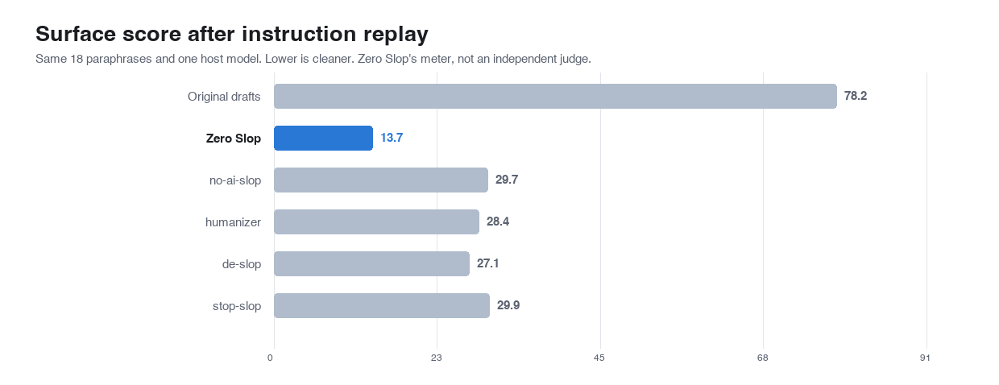
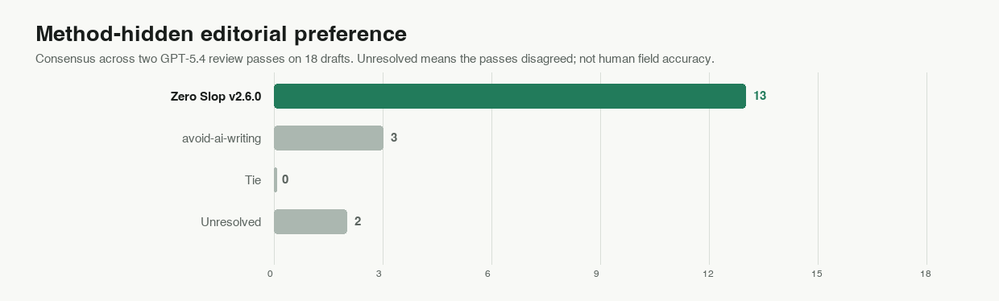
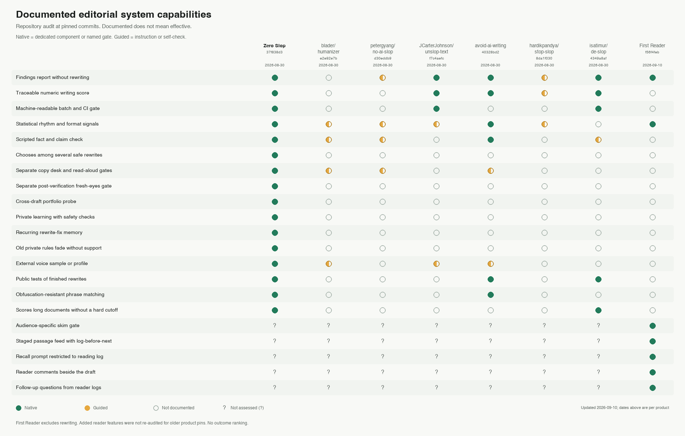

# Zero Slop

<p align="center">
  
  
  
  
  
</p>

Score your writing 0 to 100 for AI slop, then edit it out without changing a single fact.


## Problem

AI writing has an accent: "It's not X. It's Y." "Here's the thing nobody tells you."
"This marks a pivotal moment." Ask an AI to fix it and it sands off the vocabulary and
cadence that made the writing yours, and rewrites your numbers on the way.


Zero Slop is an Agent Skill and ships no model. Claude, GPT, or another compatible model
does the editing; Zero Slop supplies the workflow, the meter, and the checks that refuse
any change to a name, number, quotation or link.

## How to install Zero Slop

Paste this into Claude Code, Codex, Cursor, OpenCode, Warp, or Zed:

```text
Install the Zero Slop skill globally from https://github.com/manavmishra/ZeroSlop
```

Or install it with `npx`:

```sh
npx skills add manavmishra/ZeroSlop --global
```

ChatGPT users can download [`dist/zero-slop-single-file.md`](dist/zero-slop-single-file.md).
Claude.ai users can upload [`dist/zero-slop.zip`](dist/zero-slop.zip). `npx skills update zero-slop --global` updates an existing CLI install later.

## How to use Zero Slop

```text
/zero-slop (your writing)
```

You get the edited draft, a before-and-after score, and the flagged phrases quoted with
what needed work. `/zero-slop inspect (your writing)` reviews without rewriting.
For a folder, `slopscore.py --batch drafts/ --gate 25` exits non-zero above the threshold
and drops into CI.
## The slop that Zero Slop catches

290 weighted patterns and a 96-term lexicon, including:

1. **Binary contrasts.** "It's not X. It's Y."
2. **Throat-clearing openers.** "Here's the thing," "Let me be clear"
3. **Faux-insight setups.** "What nobody tells you," "The part everyone misses"
4. **Colon reveals.** "The best part: it learns."
5. **Dramatic fragments.** "That's it. That's the whole thing."
6. **Superficial analysis.** "highlighting the team's commitment to innovation"
7. **Importance puffery.** "marks a pivotal moment," "a testament to"
8. **Weasel attribution.** "experts agree," "studies show"
9. **Synonym cycling.** The agent, the assistant, the tool, all one thing.
10. **Marketing riders.** "robust" and "leverage" score only beside a marketing trigger, so a runbook stays quiet.

A reading pass covers what no pattern reaches, where the defect is the document rather
than any span: one shape repeated seven times, statistics piled into a paragraph,
paragraphs that shuffle without loss. [`references/eval.md`](references/eval.md) has all
76 checks.

Human writing scored 9 to 21 in [`data/corpus/must-not-flag/`](data/corpus/must-not-flag/);
unedited AI drafts averaged 77 across [`bench/examples.json`](bench/examples.json).
Neither number claims to identify who wrote the text.

## How it works


Eight roles form one workflow. Each is a job rather than a service: a single model can handle
several of them, each as its own pass, so nothing grades its own output.

| Role | Who does it | What happens |
|---|---|---|
| 1. Scorer | Local tools | Finds the exact wording, rhythm, readability, and formatting problems that raised the writing score. |
| 2. Interpreter | Your AI assistant | Reads the claims, purpose, audience, structure, and voice before changing anything. |
| 3. Rewriter | Your AI assistant | Removes stock language and rebuilds order, rhythm, and tone without inventing detail. |
| 4. Fact gate | Local tools | Rejects any version that changes names, numbers, quotations, links, code, tables, paths, or structure. |
| 5. Copy desk | Fresh AI pass | Corrects grammar, spelling, usage, and consistency in the actual deliverable. |
| 6. Read-aloud editor | Fresh AI pass | Fixes stumbles, repetition, weak transitions, and awkward flow. |
| 7. Verifier | Local tools and your AI assistant | Compares text with source for facts, meaning, qualifiers, voice, format, structure. |
| 8. Fresh-eyes finalizer | Fresh AI pass | Reads the verified text as a first-time reader, applying only safe polish. Any final polish restarts the final checks; the same text must return unchanged before release. |

Eight is an engineering choice; research supports the individual checks. Studies find
[predictable wording](https://arxiv.org/abs/2301.11305) and
[overused vocabulary](https://arxiv.org/abs/2406.07016) in machine text, and authorship
detectors can [misclassify non-native English](https://arxiv.org/abs/2304.02819). Local
tools use only Python's standard library.

## Private learning from your edits

Nothing is learned until you hand over both versions: what the assistant produced and
what you kept. Zero Slop watches nothing on its own: no file monitoring, no browser
hooks, no reaching into where you publish.

A phrase must disappear from three unrelated pieces before it becomes a private rule; a
single word needs five. Each must be new and stay silent on known-human text. Private
data stays under `$ZERO_SLOP_HOME`.

This is human-in-the-loop online learning. It never retrains Claude, GPT, or another
model, and involves no neural training or RLHF. A profile can exempt existing watchlist
words when selected by name; it does not learn cadence, tone, or a complete writing
style.


## What's inside

[`SKILL.md`](SKILL.md) has the workflow and [`references/eval.md`](references/eval.md) the
76 checks. [`scripts/slopscore.py`](scripts/slopscore.py) is the meter and fact gate,
with [`scripts/register.py`](scripts/register.py) running the reading pass.
[`bench/README.md`](bench/README.md) documents every benchmark with its limits.

## Evidence

### Against other tools, same model, same drafts

We reran Zero Slop, [avoid-ai-writing](https://github.com/conorbronsdon/avoid-ai-writing),
[no-ai-slop](https://github.com/petergyang/no-ai-slop) and
[humanizer](https://github.com/blader/humanizer) on the same 18 obvious drafts, each with
GPT-5.4, high reasoning, batches of three, and its pinned instructions.

| Method | Mean writing score ↓ | Passed all Zero Slop checks | Important details kept | Average length change |
|---|---:|---:|---:|---:|
| Original drafts | 76.3 | 0/18 | — | — |
| Zero Slop | 12.8 | 18/18 | 18/18 | -8.9% |
| avoid-ai-writing | 23.3 | 15/18 | 18/18 | -14.6% |
| no-ai-slop | 28.4 | 12/18 | 17/18 | -13.7% |
| humanizer | 35.4 | 9/18 | 17/18 | -7.2% |



Those checks are Zero Slop's own, so we also ran a method-hidden comparison against the pinned
incumbent. The GPT-5.4 reviewer favored Zero Slop on 13 drafts and avoid-ai-writing on 3,
with 2 unresolved; the passes agreed on 16 of 18. Our source check cleared 18/18 of our
rewrites and 16/18 of the incumbent's. On mean score across this second set we lost,
17.8 to 17.0.



This is a small LLM-reviewed regression study. It measures neither field accuracy nor a
universal ranking. Drafts, mappings, verdicts, hashes and limits:
[`bench/incumbent-blind-replay/`](bench/incumbent-blind-replay/). On the 38-item
editorial panel ([`bench/README.md`](bench/README.md)), v2.6.1 matched the prior 84.2% result. Its four new checks left all 114
frozen document scores unchanged and 18 human controls clear, while the four target cases
moved from 9.5 to between 30.7 and 65.1. Median throughput was 0.03% lower across 12
runs, which is local timing noise and no kind of speed claim.

### Speed

On one Apple silicon Mac: 1,000 documents in 1.9958 seconds (501.1 per second), a
15,201-word document in 0.3223 seconds, slowest stress case 2.4438 seconds, an 8,000-word
learning pass 0.1627 seconds. Editing time sits outside these numbers. None is a
service-level guarantee.

### Current models

The pinned [RAID+](https://huggingface.co/datasets/markstanl/RAID-Plus) sample yielded
7,627 usable generations:

| Model | Texts scored | Mean writing score ↓ | At or above 25 |
|---|---:|---:|---:|
| DeepSeek V3 | 1,995 | 14.5 | 10.1% |
| Gemini 3.1 Pro | 1,998 | 17.0 | 18.2% |
| Gemma 3 27B | 1,634 | 21.6 | 30.4% |
| Llama 3.3 70B | 2,000 | 25.5 | 41.7% |

RAID+ labels capture which model produced a text and say nothing about quality. In
Beemo, raw responses averaged
30.2, expert edits 25.3, human answers 20.0. Neither dataset carries quality labels.


## Where Zero Slop came from

Zero Slop stands on no-ai-slop, humanizer, de-slop, stop-slop, unslop-text and
avoid-ai-writing, adding a writing score, source protection, separate editorial passes,
private learning, portfolio analysis and release tests.



The chart records which features each project documents, and says nothing about writing
quality. Reproduce the shipped checks:

```sh
python3 tests/test_all.py
python3 scripts/calibrate.py --selftest
python3 scripts/register.py --selftest
python3 bench/make_charts.py --check
```


## License

MIT
