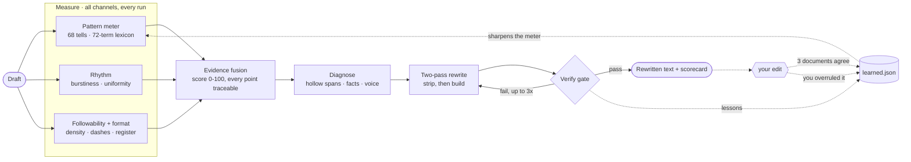

# Zero Slop

**AI writing has an accent, and readers have learned to hear it.** Zero Slop
scores any draft 0-100, strips the tells, and proves the fix with before and
after numbers. Every edit you make to its output teaches the detector.

<p align="center">
  
  
  
  
  
</p>

```bash
npx skills add manavmishra/ZeroSlop --global
```

Then say "de-slop this" in any agent.

---

## See it work

A real LinkedIn draft from August 2026. No "delve", no exclamation points, no
hype vocabulary:

> Enterprise AI value has too often compounded inside individual workflows, leaving a widening gap between the employees building leverage and the organizations trying to scale it.
>
> With OpenAI's State of Enterprise AI report and WRITER's 2026 adoption survey both out, that gap now has numbers. Frontier users send 6x more messages than the median employee…
>
> More in both reports below. 👇
>
> #AgenticAI #EnterpriseAI #AIAdoption

**Scores 45.7 of 100**, where raw model output averages 76 and strong human
writing lands between 9 and 29. Four catches, none of them a banned word:
announcement voice in the opener, the best statistic buried in paragraph two, a
cliché doing an idea's job, and a hook promising two reports while citing one.

After:

> Six times. That's how much more your best people talk to models than everyone else does, and it comes from OpenAI's own telemetry in its new State of Enterprise AI report, not a survey.
>
> WRITER's 2026 adoption survey measures the same gap in hours saved: nine a week for super-users, about two for everyone else.
>
> Then the control numbers. 35% of companies admit they couldn't immediately pull the plug on a rogue agent…

**Scores 9.5.** Every figure and both citations survived. Nothing invented.

<details>
<summary>Full scorecard and the heatmap that ships with every run</summary>

| Metric | Before | After |
|---|---|---|
| AI-likelihood | 45.7 suspect | **9.5 clean** |
| Weighted tells | 6 | 0 |
| Em-dashes / emoji / hashtags | 0 / 1 / 3 | 0 / 0 / 0 |
| Burstiness (target ≥0.45) | 0.65 | 0.79 |
| Words | 254 | 230 |

```
  SLOP MAP · 7 sentences · 5 carry tells · hottest first

  ████████  heavy    ¶1  "I'm beyond excited to"
                      LinkedIn tell — readers pattern-match this to AI instantly
  ███░░░░░  mild     ¶3  "Let's dive"
                      structural filler — delete the stem, keep the point

  by paragraph  █ · ▓ ▒   █ heavy  ▓ moderate  ▒ mild  · clean
```

Severity is absolute, so bars compare across documents. The paragraph strip
shows where slop clusters, which often means a structural problem rather than a
word problem.
</details>

## What you get

- **Detector.** 68 weighted patterns and a 72-term lexicon, plus rhythm,
  followability, and a shape channel for social posts. Every point traces to a
  quoted span.
- **Two-pass rewrite.** Strip the tells, then rebuild toward an expert register.
- **Hard gate.** The rewrite has to clear a numeric threshold that tightens by
  genre, strictest on LinkedIn. Three failures and it stops and says the draft
  needs a real detail, not better words.
- **Scorecard and heatmap.** Before and after, on every run.
- **Six platform modules.** LinkedIn, X, email, blog, newsletter, research.
- **Shape channel.** Catches broetry, reported on its own axis. Genre is
  declared by the caller, never auto-detected.
- **A reflect loop.** The gap between what the skill returned and what you
  actually published is free training signal. A span you cut becomes a pattern
  once three separate documents cut it too; a pattern you overrule three times
  loses half its weight. The meter sharpens as it is used, in both directions.
- **Learning that cannot corrupt the meter.** Nothing ships without clearing a
  corpus of certified human writing, including non-native English, which AI
  detectors are documented to over-flag.
- **CI tooling.** `--gate` exit codes, `--batch` a directory, `--explain` a
  heatmap.
- **Fidelity rules.** No invented numbers, names, anecdotes, or feelings.
  Hollow spans get flagged, never padded.

## Install

Installation differs by harness. Pick yours; skip the rest.

**Any agent:**

```bash
npx skills add manavmishra/ZeroSlop --global
```

`--agent '*'` hits every harness; `--agent claude-code` (or `codex`, `cursor`,
`opencode`, `warp`, `zed`) hits one; drop `--global` for a project-local install.

**Claude Code and Cowork, as a plugin:**

```
/plugin marketplace add manavmishra/ZeroSlop
/plugin install zero-slop@zero-slop
```

<details>
<summary>ChatGPT · Codex · claude.ai · Cowork workspaces · manual clone</summary>

**ChatGPT and ChatGPT at Work:**

```bash
curl -sLO https://raw.githubusercontent.com/manavmishra/ZeroSlop/main/dist/zero-slop-single-file.md
```

Paste it into a Project's Instructions, upload it as Custom GPT Knowledge, or
paste it at the top of a chat. The bundle carries the skill and all four
reference documents.

**Codex.** Run this in *your* project, not in a clone of this repo, since it
writes `AGENTS.md`:

```bash
curl -sL https://raw.githubusercontent.com/manavmishra/ZeroSlop/main/dist/zero-slop-single-file.md -o AGENTS.md
```

**claude.ai and Desktop:** download the repo zip, then upload it under
Settings → Capabilities → Skills.

**Cowork workspace**, so teammates inherit it:

```bash
git clone https://github.com/manavmishra/ZeroSlop.git .claude/skills/zero-slop
```

**Manual, any tool:**

```bash
git clone https://github.com/manavmishra/ZeroSlop.git ~/.claude/skills/zero-slop
```

Windows: clone into `$env:USERPROFILE\.claude\skills\zero-slop`. The folder must
be named `zero-slop`.
</details>

**Requirements:** none. Markdown plus one standard-library Python file. Where
Python is unavailable the skill falls back to its reference lists; you lose the
numeric gate, not the rewrite.

## Use it

Two doors into the same tool. The skill rewrites and explains; the CLI only
measures, which is what makes it usable in CI.

### In an agent

Say "de-slop this" and paste a draft. Say "score this" for a report without a
rewrite. Every run returns the rewritten text, a before-and-after scorecard, and
a heatmap of which sentences carried tells.

Output comes back in the form you gave it. Paste text, get text; hand it a
`.docx`, `.pdf`, or `.html` file and you get that file back.

Name your platform ("this is for LinkedIn") to load the matching module. The
research module is the one that matters most to get right: it forbids moves the
general ladder prescribes, because contractions and short punchy sentences are
themselves a tell in a journal abstract.

### Teach it

Point the loop at what the skill gave you and what you actually published:

```bash
python3 scripts/learn.py --reflect --produced out.md --shipped final.md
python3 scripts/learn.py --promote --apply    # mint what cleared threshold
python3 scripts/learn.py --demote  --apply    # relax what writers overruled
python3 scripts/learn.py --stats              # the learning curve
```

A single edit changes nothing. A span becomes a pattern only after three
independent documents cut it, because one diff cannot tell a stylistic tell
from an author trimming for length. That threshold is also what makes sharing
safe: a phrase found in three unrelated documents is a generic construction,
not anyone's sentence.

```bash
python3 scripts/learn.py --export             # prints exactly what would be shared
```

Reflection data stays on your machine, in `~/.zero-slop/`, never in the
repository. The export carries spans and counts with no source text, no
filenames, and no dates finer than a month, and it prints the whole payload for
you to read before anything is written.

### From the CLI

```bash
pbpaste | python3 scripts/slopscore.py --explain     # clipboard + heatmap
python3 scripts/slopscore.py --heatmap draft.md      # heatmap only
python3 scripts/slopscore.py --gate 25 draft.md      # exit 1 on failure (CI)
python3 scripts/slopscore.py --batch docs/           # directory, worst first
python3 scripts/slopscore.py --formal abstract.txt   # research register
python3 scripts/slopscore.py --json draft.md         # machine-readable
```

The pattern database ages. These commands keep it current:

```bash
python3 scripts/calibrate.py --human dir/ --ai dir/  # refit weights to current models
python3 scripts/calibrate.py --selftest              # false-positive regression
python3 scripts/calibrate.py --decay                 # age out stale tells
```

## How it works

<p align="center">
  
</p>

<p align="center"><em>Three interpretable channels fuse into one score, then a
two-pass rewrite runs until the gate passes or three attempts fail. What you
change afterwards feeds back into the meter.</em></p>

<details>
<summary>Diagram source (Mermaid)</summary>


</details>

## Benchmark

Fifty AI-typical drafts, six genres, blind judges on shuffled labels, each skill
running its own published prompt.

Run one gave Zero Slop 32 of 50 best-picks. A full replication with fresh judges
on the identical rewrites gave 23. Cohen's kappa 0.12: judges barely agree on
"best", so single-run headlines in this category are noise.

Pooled across 100 verdicts:

| Method | Best-picks | Composite r1 | Composite r2 |
|---|--:|--:|--:|
| **Zero Slop** | **55** | **8.01** | 7.51 |
| blader/humanizer | 40 | 7.82 | 7.51 |
| petergyang/no-ai-slop | 5 | 6.96 | 6.87 |
| isatimur/de-slop | 0 | 6.35 | 6.60 |

- Wins the plurality against a 25% chance rate (p = 1.7 × 10⁻¹⁰).
- **Not statistically separable from blader/humanizer** head to head (p = 0.15).
- Both beat the other two decisively (p < 10⁻⁷).
- Ranking held across both runs; only the margin moved.

Deterministic measures are steadier, being computed rather than judged:

| Method | Detector score | Followability | Words |
|---|--:|--:|--:|
| Original drafts | 76.5 | 0.25 | 159 |
| isatimur/de-slop | 39.8 | 0.18 | 137 |
| stacked pipeline | 32.2 | 0.16 | 114 |
| petergyang/no-ai-slop | 19.4 | 0.17 | 123 |
| blader/humanizer | 18.2 | 0.24 | 135 |
| hardikpandya/stop-slop | 17.4 | 0.11 | 116 |
| **Zero Slop v1.2** | **9.5** | **0.00** | **159** |

Every other method shrinks the draft by up to 28%. Zero Slop holds the original
length at zero tells. Harness in [`bench/`](bench/).

## Why the accent exists

Two 2024 studies measured it. Stanford found "meticulous" in AI-conference peer
reviews at nearly 35 times its pre-ChatGPT rate; Tübingen found the same class
of words surging across fifteen million biomedical abstracts.

The useful finding is what happens when you strip a model's assistant training:
detectors rate the raw base model as human 97 to 99 percent of the time. The
accent is a style acquired in post-training, and it lives in wording rather than
ideas. Rewriting removes it without touching a fact.

## What it refuses

Inventing a personal anecdote is the fastest way to make text sound human, and
the trap most tools fall into. Zero Slop treats it as the cardinal sin: no fake
numbers, names, war stories, or interior feelings. Hollow paragraphs get flagged
rather than padded. Performed candor and forced hot takes are rejected as the
louder dialect of the same disease. Where disclosure is required, disclose.

The score has limits, and the gate reports what it did not measure. A draft can
be word-clean and still read as machine-written, so a green number never means
the judgment pass was optional. During benchmarking one rewrite invented a
feeling the author never described. Two independent judges caught it, and the
rule it produced now runs on every draft.

## FAQ

**Is this an AI detector bypass?** No. Detectors flag a writing style; this
removes the style by making the writing better.

**Why does ChatGPT say "delve"?** Preference tuning. Human raters rewarded a
polished formal register and the vocabulary came with it. The lexicon shifts
between model generations, which is why the pattern database is versioned and
`calibrate.py` can refit it from your own corpus.

**Are em-dashes really a tell?** Density is. One dash doing real work is fine
almost everywhere except LinkedIn. An early version of this README used
twenty-three of them; the scorer caught it.

**Will it flatten my voice?** A sample of your real writing outranks every rule
in the skill.

**Is there a trained model in it?** No. Every channel is an interpretable
surface feature, so each point of the score traces back to a span you can read.
Trained classifiers were evaluated and rejected; the measurements are in
[references/evidence.md](references/evidence.md).

**Found a tell it missed?** Run the reflect loop on it. Once three documents
agree, `--export` packages the finding with no source text attached, ready to
attach to a PR. A regex straight into `data/learned.json` also works.

**Does my writing leave my machine?** No. Scoring and rewriting are local, and
reflection data is written to `~/.zero-slop/`, outside the repository. Sharing
is opt-in, one command, and prints the entire payload before it writes
anything.

**Can the learning loop be poisoned?** Not by one person. Three independent
documents are required, spans carrying figures or proper nouns are discarded as
content rather than style, and nothing ships that fires on, or borrows four
consecutive words from, the certified-human corpus. A pattern that would
convict Lincoln or an SRE runbook is rejected at any level of evidence.

## Credits

Builds on [petergyang/no-ai-slop](https://github.com/petergyang/no-ai-slop),
[blader/humanizer](https://github.com/blader/humanizer),
[isatimur/de-slop](https://github.com/isatimur/de-slop) and
[hardikpandya/stop-slop](https://github.com/hardikpandya/stop-slop), all MIT;
Wikipedia's [Signs of AI writing](https://en.wikipedia.org/wiki/Wikipedia:Signs_of_AI_writing);
Paul Graham's essays on writing; and the detection literature cited in
[references/evidence.md](references/evidence.md).

## License

[MIT](LICENSE).
