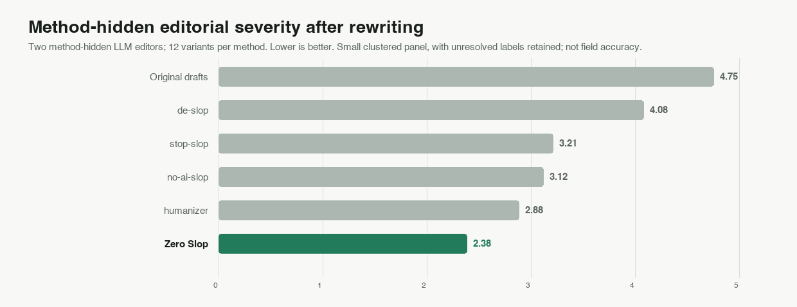
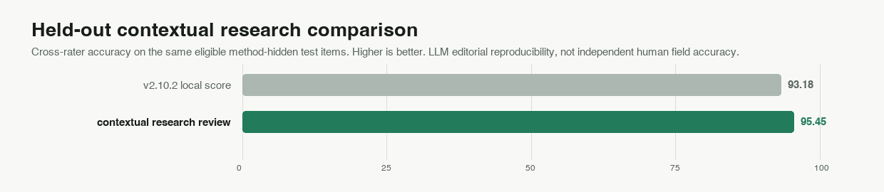

# Zero Slop: AI Writing Editor and Slop Detector

<p align="center">
  
  
  
  
  
</p>

**Less slop, more pop in all your writing.**

Zero Slop is an Agent Skill, not an AI model. Claude, GPT, or another compatible model
in your assistant edits the draft; Zero Slop supplies the method and local checks. The
assistant removes generic language without changing meaning, voice, or format.

The 0-to-100 writing score tracks generic AI-style language and lists flagged phrases;
it does not identify the author. In the test sets, human samples scored 9 to 21;
unedited AI drafts averaged 77. These are reference points, not universal boundaries.


## Install Zero Slop

Paste this into Claude Code, Codex, Cursor, OpenCode, Warp, Zed, or another
Agent Skills-compatible assistant:

```text
Install or update Zero Slop from https://github.com/manavmishra/ZeroSlop for
this agent.

1. Find active installations. Report each path, version, and method. Do not duplicate
   or remove one without asking.
2. For updates, keep the existing install method. In Codex, use $skill-installer for
   `skills/zero-slop`; in Claude Code or Cowork, use the plugin marketplace. Otherwise
   use `npx skills add manavmishra/ZeroSlop --global` to install or
   `npx skills update zero-slop --global` to update.
3. Preserve ZERO_SLOP_HOME (default: ~/.zero-slop) and its private data.
4. Verify the version. When Python is available, run
   `python3 scripts/calibrate.py --selftest`.
5. Report the path, method, version, validation result, and restart requirement.

Do not modify the current project or unrelated configuration. Ask before falling
back to a project-local installation.
```

Direct terminal install:

```bash
npx skills add manavmishra/ZeroSlop --global
```

Claude Code and Cowork can install from the plugin marketplace. ChatGPT users can
download [`dist/zero-slop-single-file.md`](dist/zero-slop-single-file.md); Claude.ai
users can use the release zip.

## How Zero Slop works


Seven roles form one workflow. They are jobs, not separate models. Claude, GPT, or
another compatible model handles the editorial passes; local Python tools run
repeatable checks. No Zero Slop AI service receives the draft.

| Role | Who does it | What it does |
|---|---|---|
| 1. Scorer | Local tools | Finds exact phrases, mechanical rhythm, dense passages, and distracting formatting; explains the writing score. |
| 2. Interpreter | Your AI assistant | Reads claims, support, audience, structure, and voice before editing. |
| 3. Rewriter | Your AI assistant | Removes stock wording and improves order, rhythm, and tone without inventing detail. |
| 4. Fact gate | Local tools | Rejects versions that add or drop names, numbers, quotations, or links; selects the clearest one left. |
| 5. Copy desk | Fresh AI pass | Corrects grammar, spelling, usage, and consistency. |
| 6. Read-aloud editor | Fresh AI pass | Fixes stumbles, repetition, weak transitions, and awkward flow. |
| 7. Verifier | Local tools and your AI assistant | Compares the final text with the source for facts, meaning, voice, format, and structure. A repair repeats both editorial passes and every check. |

### Why separate the work?

Research supports the checks, not an optimal count.
Studies have found [predictable wording](https://arxiv.org/abs/2301.11305) and
[excess vocabulary](https://arxiv.org/abs/2406.07016) in machine-written text. Editorial
research distinguishes problems with substance, facts, coherence, and tone. AI detectors can
[misclassify non-native English](https://arxiv.org/abs/2304.02819), so this score locates
writing problems; it never guesses who wrote the draft.

Separation is an engineering safeguard. The rewriter does not certify its own facts,
and the copy desk and read-aloud editor remain separate because grammatically correct
prose can still sound stiff. The verifier checks the exact text a reader will receive;
late edits can introduce errors. [Research notes](references/evidence.md) explain the
rationale and limits.

The local tools use Python's standard library and never send drafts over the network.
Word-guessing and cross-draft checks stay separate from the writing score.

## Private learning from writer edits

Learning requires the version returned by the assistant and the version the writer
kept. Zero Slop never monitors files, browsers, or publishing systems.

A phrase must be cut from three unrelated pieces before becoming a private rule;
single-word cuts need five unrelated pieces. Each proposal is tested against human
writing that must remain unflagged. Repeated replacements guide later edits, phrases
the writer keeps can quiet a rule, and old rules fade. The private, reversible rules under
`$ZERO_SLOP_HOME` never retrain the AI model.

## Does Zero Slop work?

Tests cover editorial quality, repeatability, and processing speed. No single
number can settle writing quality.

### The clearest signal so far

Two independent LLMs reviewed 72 passages from 12 drafts without tool names, rating
slop from 1 (clean) to 5 (sloppy throughout). Scores averaged 4.75 before editing and
2.38 after Zero Slop. Agreement was 77.8%. Excluding disagreements and borderline
calls left 38 shared decisions and 34 unresolved cases. The sample is small, and the
reviewers are LLMs, not people.



### Why context matters

In a 22-passage experiment, an LLM that read the surrounding text agreed with another
LLM 95.45% of the time, versus 79.54% for the writing score alone. This compares LLMs,
not people, and the experimental check is not part of the installed skill.



### The same drafts, edited five ways

We ran five workflows on the same 18 deliberately generic drafts. A passage passed
only if it met the writing and layout limits without altering facts or inventing feelings.

| Method | Mean writing score ↓ | Passed all checks | Automated fact check | Average length change |
|---|---:|---:|---:|---:|
| Original drafts | 78.2 | 0/18 | — | — |
| Zero Slop | 15.4 | 18/18 | 18/18 | -26.4% |
| humanizer | 24.3 | 13/18 | 18/18 | -25.7% |
| stop-slop | 24.7 | 13/18 | 18/18 | -34.4% |
| no-ai-slop | 28.5 | 12/18 | 18/18 | -28.0% |
| de-slop | 54.3 | 6/18 | 18/18 | -18.5% |


All 18 Zero Slop edits passed, but this is not a neutral ranking: Zero Slop defines the
rules. No available set combines broad, current writing with independent human review,
so there is no universal accuracy number. AIStoryHub, Beemo, and the Slop Index remain
limited cross-checks documented in [`bench/README.md`](bench/README.md).

### The local tools are fast

On one Apple silicon Mac, the local checker processed 1,000 documents in 2.4986 seconds
(400.2 per second). A 15,201-word document took 0.3526 seconds; the slowest stress case
took 2.4453 seconds. An 8,000-word learning pass took 0.1478 seconds. AI-assistant time
is excluded.

## What Zero Slop adds

Zero Slop builds on [no-ai-slop](https://github.com/petergyang/no-ai-slop),
[humanizer](https://github.com/blader/humanizer), [de-slop](https://github.com/isatimur/de-slop),
and [stop-slop](https://github.com/hardikpandya/stop-slop). It adds a local writing
score, fact protection, separate editorial passes, private learning, and release tests.

The chart records documented features in pinned repository versions; it does not decide which tool writes better. Details are in [`bench/README.md`](bench/README.md).


## Reproduce the tests and benchmarks

```bash
python3 tests/test_all.py
python3 scripts/calibrate.py --selftest
python3 bench/search-corpus/compare.py --check
python3 bench/quality-corpus/evaluate.py --manifest bench/quality-corpus/manifest.json \
  --labels bench/quality-corpus/labels-rater-a.json \
  --labels bench/quality-corpus/labels-rater-b.json \
  --out bench/quality-corpus/results.json --check
python3 bench/feature-ablation/check.py
python3 bench/validate_corpus_registry.py
python3 bench/make_charts.py --check
```

`SKILL.md` defines the skill; `scripts/` holds the local tools; `bench/` holds test
inputs and results. See the [security policy](SECURITY.md) for privacy and the
[research notes](references/evidence.md) for sources.

Released under the [MIT License](LICENSE).
