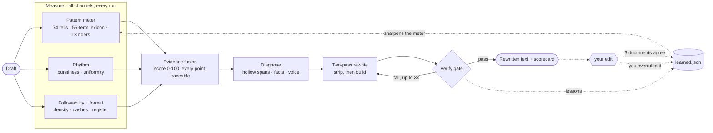

# Zero Slop

**AI writing has an accent, and readers have learned to hear it.** Zero Slop
scores any draft 0-100, strips the tells, and proves the fix with before and
after numbers. Every edit you make to its output teaches the detector.

<p align="center">
  
  
  
  
  
</p>

```bash
npx skills add manavmishra/ZeroSlop --global
```

Then say "de-slop this" in any agent.

---

## See it work

Two sentences a product marketer would call finished:

> We're thrilled to announce that our team has leveraged cutting-edge AI to deliver a seamless onboarding experience, reducing setup time by 40%.

```console
$ python3 scripts/slopscore.py --explain draft.md
AI-likelihood: 100.0/100  [slop]
  tell density : 38.33 weighted hits /100w (22 words)

  charged spans (6), heaviest first:
       5  linkedin       announce-excited       "We're thrilled to"
       4  marketing      marketing-register     'cutting-edge'
       4  marketing      marketing-register     'seamless'
       4  lexicon        cutting-edge           'cutting-edge'
       4  lexicon        seamless               'seamless'
       2  rider          leverage               'leveraged'
                                                = 23 weighted, 38.33 per 100 words
```

Six spans carry the whole score, and each one names itself. `seamless` is
charged twice on purpose, once as marketing register and once as vocabulary,
because the two channels are independent evidence. `leveraged` scores only 2:
it is a *rider*, silent in a sentence like "we leveraged the existing index"
and charged here because marketing words share its sentence.

Strike the six and one fact is left standing:

> We cut onboarding setup time by 40% using AI.

```console
$ python3 scripts/slopscore.py --explain rewrite.md
AI-likelihood: 9.5/100  [clean]
  tell density : 0.00 weighted hits /100w (8 words)

  charged spans: none — the score is rhythm and format only
```

Twenty-two words to eight, and the only survivor is the 40%. That ratio is the
point: most of the original was decoration around a single measurement, which
is what the AI accent usually turns out to be on inspection.

**About that 9.5.** It is the floor, not a grade. A document with zero charged
spans scores 9.5 no matter what it says, and so does the string `Hello`. For
scale, the 50 raw AI drafts in [`bench/`](bench/) average 70 and the
certified-human writing in [`data/corpus/`](data/corpus/must-not-flag/) lands
between 9 and 21 — but read the tell count and the charged-span list first. The
composite is for ranking drafts against each other and for CI thresholds, not
for judging one text in isolation. It cannot tell you whether the sentence is
*worth* writing, which is why the gate prints what it did not measure.

Reproduce both runs:

```bash
printf "We're thrilled to announce that our team has leveraged cutting-edge AI to deliver a seamless onboarding experience, reducing setup time by 40%%." | python3 scripts/slopscore.py --explain
```

## What you get

- **Detector.** 74 weighted patterns, a 55-term lexicon, and 13 context-gated
  riders that stay silent in honest technical prose, plus rhythm,
  followability, and a shape channel for social posts. Every point traces to a
  quoted span.
- **Two-pass rewrite.** Strip the tells, then rebuild toward an expert register.
- **Hard gate.** The rewrite has to clear a numeric threshold that tightens by
  genre, strictest on LinkedIn. Three failures and it stops and says the draft
  needs a real detail, not better words.
- **Scorecard and heatmap.** Before and after, on every run.
- **Six platform modules.** LinkedIn, X, email, blog, newsletter, research.
- **Shape channel.** Catches broetry, reported on its own axis. Genre is
  declared by the caller, never auto-detected.
- **A reflect loop.** The gap between what the skill returned and what you
  actually published is free training signal. A span you cut becomes a pattern
  once three separate documents cut it too; a pattern you overrule three times
  loses half its weight. The meter sharpens as it is used, in both directions.
- **Learning that cannot corrupt the meter.** Nothing ships without clearing a
  corpus of certified human writing, including non-native English, which AI
  detectors are documented to over-flag.
- **CI tooling.** `--gate` exit codes, `--batch` a directory, `--explain` a
  heatmap.
- **Fidelity rules.** No invented numbers, names, anecdotes, or feelings.
  Hollow spans get flagged, never padded.

## Install

Installation differs by harness. Pick yours; skip the rest.

**Any agent:**

```bash
npx skills add manavmishra/ZeroSlop --global
```

`--agent '*'` hits every harness; `--agent claude-code` (or `codex`, `cursor`,
`opencode`, `warp`, `zed`) hits one; drop `--global` for a project-local install.

**Claude Code and Cowork, as a plugin:**

```
/plugin marketplace add manavmishra/ZeroSlop
/plugin install zero-slop@zero-slop
```

<details>
<summary>ChatGPT · Codex · claude.ai · Cowork workspaces · manual clone</summary>

**ChatGPT and ChatGPT at Work:**

```bash
curl -sLO https://raw.githubusercontent.com/manavmishra/ZeroSlop/main/dist/zero-slop-single-file.md
```

Paste it into a Project's Instructions, upload it as Custom GPT Knowledge, or
paste it at the top of a chat. The bundle carries the skill and all five
reference documents.

**Codex.** Run this in *your* project, not in a clone of this repo, since it
writes `AGENTS.md`:

```bash
curl -sL https://raw.githubusercontent.com/manavmishra/ZeroSlop/main/dist/zero-slop-single-file.md -o AGENTS.md
```

**claude.ai and Desktop:** download the repo zip, then upload it under
Settings → Capabilities → Skills.

**Cowork workspace**, so teammates inherit it:

```bash
git clone https://github.com/manavmishra/ZeroSlop.git .claude/skills/zero-slop
```

**Manual, any tool:**

```bash
git clone https://github.com/manavmishra/ZeroSlop.git ~/.claude/skills/zero-slop
```

Windows: clone into `$env:USERPROFILE\.claude\skills\zero-slop`. The folder must
be named `zero-slop`.
</details>

**Requirements:** none. Markdown plus one standard-library Python file. Where
Python is unavailable the skill falls back to its reference lists; you lose the
numeric gate, not the rewrite.

## Use it

Two doors into the same tool. The skill rewrites and explains; the CLI only
measures, which is what makes it usable in CI.

### In an agent

Say "de-slop this" and paste a draft. Say "score this" for a report without a
rewrite. Every run returns the rewritten text, a before-and-after scorecard, and
a heatmap of which sentences carried tells.

Output comes back in the form you gave it. Paste text, get text; hand it a
`.docx`, `.pdf`, or `.html` file and you get that file back.

Name your platform ("this is for LinkedIn") to load the matching module. The
research module is the one that matters most to get right: it forbids moves the
general ladder prescribes, because contractions and short punchy sentences are
themselves a tell in a journal abstract.

### Teach it

Point the loop at what the skill gave you and what you actually published:

```bash
python3 scripts/learn.py --reflect --produced out.md --shipped final.md
python3 scripts/learn.py --promote --apply    # mint what cleared threshold
python3 scripts/learn.py --demote  --apply    # relax what writers overruled
python3 scripts/learn.py --stats              # the learning curve
```

A single edit changes nothing. A span becomes a pattern only after three
independent documents cut it, because one diff cannot tell a stylistic tell
from an author trimming for length. That threshold is also what makes sharing
safe: a phrase found in three unrelated documents is a generic construction,
not anyone's sentence.

```bash
python3 scripts/learn.py --export             # prints exactly what would be shared
```

Reflection data stays on your machine, in `~/.zero-slop/`, never in the
repository. The export carries spans and counts with no source text, no
filenames, and no dates finer than a month, and it prints the whole payload for
you to read before anything is written.

### From the CLI

```bash
pbpaste | python3 scripts/slopscore.py --explain     # clipboard + heatmap
python3 scripts/slopscore.py --heatmap draft.md      # heatmap only
python3 scripts/slopscore.py --gate 25 draft.md      # exit 1 on failure (CI)
python3 scripts/slopscore.py --batch docs/           # directory, worst first
python3 scripts/slopscore.py --formal abstract.txt   # research register
python3 scripts/slopscore.py --json draft.md         # machine-readable
```

The pattern database ages. These commands keep it current:

```bash
python3 scripts/calibrate.py --human dir/ --ai dir/  # refit weights to current models
python3 scripts/calibrate.py --selftest              # false-positive regression
python3 scripts/calibrate.py --decay                 # age out stale tells
```

## How it works

<p align="center">
  
</p>

<p align="center"><em>Three interpretable channels fuse into one score, then a
two-pass rewrite runs until the gate passes or three attempts fail. What you
change afterwards feeds back into the meter.</em></p>

<details>
<summary>Diagram source (Mermaid)</summary>


</details>

## Benchmark

Fifty AI-typical drafts, six genres, blind judges on shuffled labels.

**Read the limits before the numbers, because they are unusually severe.**
Competitor outputs in [`bench/outputs/`](bench/outputs/) were *authored to
represent* each tool's published prompt, not produced by executing it — there
are no invocation logs, and `build_h1.py` is a Python file of string literals.
Zero Slop's rewrites had the scorer in the loop iterating to a gate; the others
got one pass. That is not a level field, and it means this comparison is a
design study, not a head-to-head. Judge prompts and model ids were not
recorded, so the judged numbers are not independently auditable either.

Run one gave Zero Slop 32 of 50 best-picks. A replication with fresh judges on
identical rewrites gave 23. Cohen's kappa 0.12: judges barely agree on "best",
so single-run headlines in this category are noise. Pooled across 100 verdicts:

| Method | Best-picks | Composite r1 | Composite r2 |
|---|--:|--:|--:|
| **Zero Slop** | **55** | **8.01** | 7.51 |
| blader/humanizer | 40 | 7.82 | 7.51 |
| petergyang/no-ai-slop | 5 | 6.96 | 6.87 |
| isatimur/de-slop | 0 | 6.35 | 6.60 |

- Wins the plurality against a 25% chance rate (p = 1.7 × 10⁻¹⁰).
- **Not statistically separable from blader/humanizer** head to head (p = 0.15).
- Both beat the other two decisively (p < 10⁻⁷).

### The result that goes against us

**Zero Slop ranked last of four on judge-rated fidelity, in both runs** — 8.80
against blader 9.32, petergyang 9.58, de-slop 9.66. It also carried the only
fabrication flag in run one: a rewrite invented a feeling the author never
described, and two independent judges caught it.

That is the exact failure the skill's first hard rule forbids, and it is the
most useful thing this benchmark produced. The cause is structural: the verify
gate has channels for vocabulary, rhythm, format and followability, and **none
for fidelity**. Nothing in the loop measures the property the product claims
matters most; it is enforced by instruction alone. The incident produced the
interior-experience rule that now runs on every draft, but the gap in the gate
is still open and is the top item on the roadmap.

Deterministic measures are steadier, being computed rather than judged. One
caveat first: **this column is scored by Zero Slop's own detector**, so it shows
how much of the surface register each method removes as measured by the thing
that defines the register, not an independent verdict.

| Method | Detector score | Followability | Words |
|---|--:|--:|--:|
| Original drafts | 70.3 | 0.46 | 159 |
| isatimur/de-slop | 26.9 | 0.41 | 137 |
| stacked pipeline | 23.5 | 0.38 | 114 |
| blader/humanizer | 19.5 | 0.46 | 135 |
| petergyang/no-ai-slop | 19.1 | 0.41 | 123 |
| hardikpandya/stop-slop | 17.2 | 0.33 | 116 |
| **Zero Slop v1.2** | **10.0** | **0.07** | **159** |

**These two tables describe different builds.** The 55 best-picks were won by
v1.0, which cut drafts 22% shorter. The row above is v1.2, which holds length —
and which no judge ever saw. Do not read the length column as a judged result.

Harness in [`bench/`](bench/). The honest summary is: statistically tied with a
much simpler tool, on a benchmark we wrote, against competitor outputs we wrote
ourselves, while losing on the dimension we care most about.

## Why this matters now

Four platforms moved within two weeks of each other in late July and early
August 2026, and the common thread is that reach, not taste, is now the penalty.

**LinkedIn** added a control letting any reader report a post or comment as
AI-generated. Reports hide the post for that reader and train LinkedIn's
classifiers; flagged posts lose algorithmic reach beyond the author's own
network, and repeat authors get private notices in their analytics. LinkedIn's
chief product officer says the platform is catching hundreds of thousands of
automated comment attempts daily. It also retired the "enhance this post"
generator in favour of a plain proofreader. **Snapchat** stopped recommending
wholly AI-generated video in Spotlight. **YouTube** made generic, repetitive and
template-based video ineligible for monetisation. **Substack** shipped a
reader-facing detector for AI writing, with its CEO citing research that up to
40% of writing on social media is now synthetic.

Every one of them draws the same line: AI used to *refine* your work is fine,
AI used to *produce* it is not. That is exactly the line this skill is built
for — it never generates a draft, it measures and rewrites yours.

Two design consequences follow. The systems on the other side are trained on
**reader reports**, so the target is perception rather than any fixed word list,
which is what the reflect loop tracks. And a false negative now costs
distribution rather than a little credibility, which raises the value of
catching structural tells: the discrimination corpus contains a post scoring
38.6 with **zero** charged spans, caught on rhythm and shape alone.

Sources: [BBC, 4 Aug 2026](https://www.bbc.com/news/articles/c77g6dm5pr8o) ·
[Forbes, 1 Aug 2026](https://www.forbes.com/sites/gabrielalinzainescu/2026/08/01/snapchat-and-linkedin-launch-new-tools-to-curb-ai-slop-in-feeds/)

## Why the accent exists

Two 2024 studies measured it. Stanford found "meticulous" in AI-conference peer
reviews at nearly 35 times its pre-ChatGPT rate; Tübingen found the same class
of words surging across fifteen million biomedical abstracts.

The useful finding is what happens when you strip a model's assistant training:
detectors rate the raw base model as human 97 to 99 percent of the time. The
accent is a style acquired in post-training, and it lives in wording rather than
ideas. Rewriting removes it without touching a fact.

<details>
<summary>The thirteen papers this is built on</summary>

Every design decision below traces to one of these. Full reasoning, including
which findings were rejected, is in [references/evidence.md](references/evidence.md).

| Finding used here | Source |
|---|---|
| Detectors classify the post-training register, not machine generation: base models rate 97–99% human | [arXiv:2605.19516](https://arxiv.org/abs/2605.19516) |
| Excess-vocabulary method — how `calibrate.py` derives weights from frequency differentials | Kobak et al., [arXiv:2406.07016](https://arxiv.org/abs/2406.07016) |
| Style-word surge across AI-era corpora; era-dependence of "delve" | Juzek & Ward, [arXiv:2412.11385](https://arxiv.org/abs/2412.11385) |
| **Detectors misclassify >50% of non-native English as AI** — why the corpus has an ESL sample | Liang et al., [arXiv:2304.02819](https://arxiv.org/abs/2304.02819) (*Patterns* 4:100779) |
| Detector decay across model generations — why no trained classifier ships | RAID, [arXiv:2405.07940](https://arxiv.org/abs/2405.07940) |
| Perplexity/curvature detection and its limits | DetectGPT [2301.11305](https://arxiv.org/abs/2301.11305), Binoculars [2401.12070](https://arxiv.org/abs/2401.12070) |
| Burstiness and sentence-length variance as a human signal | Muñoz-Ortiz [2308.09067](https://arxiv.org/abs/2308.09067), Reinhart [2410.16107](https://arxiv.org/abs/2410.16107) |
| Human raters cannot reliably identify AI text unaided | Herbold [2304.14276](https://arxiv.org/abs/2304.14276), Liang [2403.07183](https://arxiv.org/abs/2403.07183) |
| Stylometric drift and register analysis | [2303.13408](https://arxiv.org/abs/2303.13408), [2310.06202](https://arxiv.org/abs/2310.06202) |

</details>

## What it refuses

Inventing a personal anecdote is the fastest way to make text sound human, and
the trap most tools fall into. Zero Slop treats it as the cardinal sin: no fake
numbers, names, war stories, or interior feelings. Hollow paragraphs get flagged
rather than padded. Performed candor and forced hot takes are rejected as the
louder dialect of the same disease. Where disclosure is required, disclose.

The score has limits, and the gate reports what it did not measure. A draft can
be word-clean and still read as machine-written, so a green number never means
the judgment pass was optional. During benchmarking one rewrite invented a
feeling the author never described. Two independent judges caught it, and the
rule it produced now runs on every draft.

## FAQ

**Is this an AI detector bypass?** No. Detectors flag a writing style; this
removes the style by making the writing better.

**Why does ChatGPT say "delve"?** Preference tuning. Human raters rewarded a
polished formal register and the vocabulary came with it. The lexicon shifts
between model generations, which is why the pattern database is versioned and
`calibrate.py` can refit it from your own corpus.

**Are em-dashes really a tell?** Density is. One dash doing real work is fine
almost everywhere except LinkedIn. An early version of this README used
twenty-three of them; the scorer caught it.

**Will it flatten my voice?** A sample of your real writing outranks every rule
in the skill.

**Is there a trained model in it?** No. Every channel is an interpretable
surface feature, so each point of the score traces back to a span you can read.
Trained classifiers were evaluated and rejected; the measurements are in
[references/evidence.md](references/evidence.md).

**Found a tell it missed?** Run the reflect loop on it. Once three documents
agree, `--export` packages the finding with no source text attached, ready to
attach to a PR. A regex straight into `data/learned.json` also works.

**Does my writing leave my machine?** No. Scoring and rewriting are local, and
reflection data is written to `~/.zero-slop/`, outside the repository. Sharing
is opt-in, one command, and prints the entire payload before it writes
anything.

**Can the learning loop be poisoned?** Not by one person. Three independent
documents are required, spans carrying figures or proper nouns are discarded as
content rather than style, and nothing ships that fires on, or borrows four
consecutive words from, the certified-human corpus. A pattern that would
convict Lincoln or an SRE runbook is rejected at any level of evidence.

## Credits

Builds on [petergyang/no-ai-slop](https://github.com/petergyang/no-ai-slop),
[blader/humanizer](https://github.com/blader/humanizer),
[isatimur/de-slop](https://github.com/isatimur/de-slop) and
[hardikpandya/stop-slop](https://github.com/hardikpandya/stop-slop), all MIT;
Wikipedia's [Signs of AI writing](https://en.wikipedia.org/wiki/Wikipedia:Signs_of_AI_writing);
Paul Graham's essays on writing; and the detection literature cited in
[references/evidence.md](references/evidence.md).

## License

[MIT](LICENSE).
