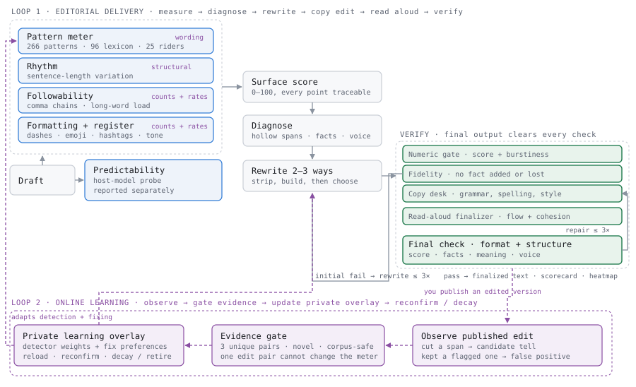
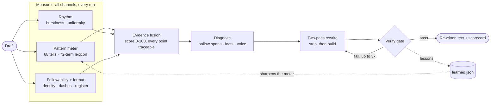

# Zero Slop

**A linter for the AI accent.** Scores a draft, strips the tells, proves the fix.

Zero Slop is an agent skill that removes the writing style language models pick
up in post-training (the em-dash rhythm, the "delve" vocabulary, the
announcement voice) and reports before/after scores from a detector it ships
with. Every other humanizer asks you to trust it. This one hands you the
numbers.

```bash
npx skills add manavmishra/ZeroSlop --global
```

Then say "de-slop this" in any agent, or "score this" for a report with no
rewrite.

<p align="center">
  
  
  
  
  
</p>

## What you get

| | |
|---|---|
| **A detector you can run** | 68 weighted patterns, a 72-term lexicon, rhythm and followability statistics. Scores any text 0–100, with every point traceable to a quoted span. |
| **A rewrite that keeps your facts** | Two passes: strip the tells, then rebuild toward an expert register. Invented facts, invented numbers, and invented feelings are all forbidden and tested for. |
| **A pass/fail gate** | LinkedIn ≤20, general ≤25, email ≤35, research on its own formal track. Fail three times and it tells you the draft needs a real detail, rather than faking one. |
| **A scorecard on every run** | Before and after, with the patterns fixed named individually. |
| **Six platform modules** | LinkedIn, X, email, blog, newsletter, and research each get their own rules. A research abstract is not casualised; a LinkedIn post is not left with em-dashes. |
| **A memory** | Every miss becomes a pattern in `data/learned.json`. Community PRs sharpen the detector for everyone. |
| **CI and batch tooling** | `--gate` for exit codes, `--batch` to score a whole directory worst-first, `--explain` for a per-sentence heatmap. |

## Who it is for

**People who publish under their own name.** Founders, operators and creators
posting on LinkedIn, where "this was written by ChatGPT" in the comments costs
more than the post earns. The LinkedIn module is the most opinionated in the
package for exactly this reason.

**Communications and content teams.** Newsletters, blogs and launch emails
that need to sound like the company rather than like every other company.
`--batch` audits an entire content directory in one command.

**Researchers and analysts.** The formal track keeps calibrated hedging and
technical register intact while removing puffery, copula inflation and
unearned significance claims. It will not casualise your abstract.

**Engineering teams shipping docs.** `--gate` returns a non-zero exit code, so
slop becomes a pre-commit hook or a CI check like any other lint rule.

**Anyone running an agent that writes.** Because the skill is portable across
harnesses, the same quality bar applies whether the draft came from Claude
Code, Codex, or a human on the team.

## Why the AI accent exists

Two research teams measured it in 2024. A Stanford group found "meticulous"
appearing in AI-conference peer reviews at nearly 35 times its pre-ChatGPT
rate. A Tübingen group, working across fifteen million biomedical abstracts,
found the same class of words surging: "delve," "showcase," "intricate."
Researchers had started drafting with ChatGPT, and ChatGPT has favorite words.

Readers caught on fast. An em-dash on LinkedIn now gets you accused of
outsourcing your thinking, and WikiProject AI Cleanup has catalogued the tells
since 2023.

Here is the part that makes the problem solvable. Run one model in two
versions, the raw base model and the same model after assistant training, and
commercial detectors call the raw version human 97 to 99 percent of the time. The accent is not in the machine. It is a style acquired in the last
stage of training, and it lives in wording, not ideas. Rewriting removes it
without touching a fact.

## A real run, start to finish

In August 2026, a founder drafted a LinkedIn post about two new enterprise-AI
reports. The full draft, as written:

> Enterprise AI value has too often compounded inside individual workflows, leaving a widening gap between the employees building leverage and the organizations trying to scale it.
>
> With OpenAI's State of Enterprise AI report and WRITER's 2026 adoption survey both out, that gap now has numbers. Frontier users send 6x more messages than the median employee, and that's OpenAI's own telemetry, not a survey. Super-users save 9 hours a week against 2 for everyone else. 35% of companies admit they couldn't immediately pull the plug on a rogue agent, and 36% have no formal plan for supervising agents at all. The result shows up in the ROI line: only 29% see significant returns from generative AI, and just 23% from agents, despite 5x individual gains.
>
> OpenAI's own conclusion says the quiet part out loud: the constraint is no longer model performance or tooling. It's organizational readiness. The individual wins are real. What's missing is the boring, unglamorous work that turns them into an operating system for the whole company.
>
> That work has names. Standardization, so the best prompt in the building becomes the default prompt, not a personal stash. AI fluency for the entire org, not certification theater but every function knowing how to shape its own work for a model. Skills and workflows as shared assets with owners and versions. And supervision that scales with autonomy, including the off switch.
>
> The playbook is already inside the building. Your super-users are writing it daily. The work is making it everyone's.
>
> More in both reports below. 👇
>
> #AgenticAI #EnterpriseAI #AIAdoption

No "delve," no exclamation points, no hype vocabulary, and the scorer still
read it at 45.7: "suspect." The diagnosis was the more useful output. The opener is
announcement voice, an abstraction warming up the crowd while the draft's
best material, a startling statistic, sits buried in paragraph two. The
"quiet part out loud" line is a cliché doing an idea's job. And the hook
promises "two reports" but only ever attaches the 6x to one of them, which
reads oddly hollow without the reader knowing why.

The rewrite, after the full loop:

> Six times. That's how much more your best people talk to models than everyone else does, and it comes from OpenAI's own telemetry in its new State of Enterprise AI report, not a survey.
>
> WRITER's 2026 adoption survey measures the same gap in hours saved: nine a week for super-users, about two for everyone else.
>
> Then the control numbers. 35% of companies admit they couldn't immediately pull the plug on a rogue agent. 36% have no formal plan for supervising agents at all. And after all the 5x individual-gain stories, only 29% see significant returns from generative AI. From agents, 23%.
>
> OpenAI's own conclusion reads like something a critic would write, not a vendor: the constraint is no longer the models or the tooling, it's whether the organization is ready to use them. The individual wins are real, and they stay individual, stranded one desk at a time, until somebody does the boring work of turning them into an operating system for the whole company.
>
> That work has names. Standardization, so the best prompt in the building becomes the default instead of somebody's personal stash. AI fluency across every function, not certification theater. Skills and workflows treated as shared assets, with owners and versions. Supervision that scales with autonomy, including the off switch.
>
> The playbook is already inside the building. Your super-users are writing it daily. The work is making it everyone's.

The scorecard that shipped with it:

| Metric | Before | After |
|---|---|---|
| AI-likelihood | 45.7 — suspect | **9.5 — clean** |
| Weighted tells | 6 | 0 |
| Em-dashes / emoji / hashtags | 0 / 1 / 3 | 0 / 0 / 0 |
| Burstiness (target ≥ 0.45) | 0.65 | 0.79 |
| Words | 254 | 230 |

Every figure and both citations survived. Nothing was invented. The number
moved to the first word, each report got its own statistic, and the author's
best lines ("That work has names," "certification theater," the closing
triplet) came through untouched, because the diagnose pass had marked them as
voice to protect.

This README is held to the same bar. Its prose scores clean; score the raw
file and the number jumps, because the file quotes the tells it teaches and a
regex cannot tell mention from use. That gap is the design lesson. The meter
flags, judgment decides. Check it yourself: `python3 scripts/slopscore.py
README.md`.

## How it works

Five steps. Each one is there because a measurement says it should be.

**Measure.** A two-hundred-line Python script (standard library, no network,
no dependencies) scores the draft: weighted tells across sixty-plus patterns,
sentence-rhythm variance, the overused-word lexicon, formatting noise, and a
followability check that catches prose too dense to absorb.

**Diagnose.** The judgments no regex can make. Which paragraphs say nothing
and would vanish without loss. Which facts must survive verbatim. Which
quirks are the writer's actual voice, and therefore protected.

**Rewrite.** Two passes, because testing showed one combined pass does worse.
First strip the tells. Then build toward an expert register: a practitioner
writing for peers, authority earned by specifics, one idea per sentence, and
the confidence to say the simple true thing.

**Verify.** A hard gate. A LinkedIn post must score 20 or under with zero
em-dashes, zero emoji, zero hashtag clusters. Fail, and the loop iterates.
Fail three times, and it says so instead of pretending.

**Learn.** Every miss becomes a pattern in `data/learned.json`, with a dated
entry in the log. The day this skill shipped, a user caught it attributing
one report's statistic to two reports; that mistake is now a named check
that runs on every future draft.

## The engine

Three interpretable channels, no black box. Every point of the score traces
back to a span you can read, which is the property that makes the gate
arguable rather than oracular.

We built and trained a MaxEnt classifier for a fourth channel and then cut
it. It scored 0.985 AUC in-domain, and on current-era drafts it rated real
AI slop as human. A model that is confidently wrong on the text you actually
have is worse than no model. The full negative result, including why SVMs
and HMMs were rejected earlier, is in
[references/evidence.md](references/evidence.md).

<p align="center">
  
</p>

<details>
<summary>Diagram source (Mermaid)</summary>



</details>

## The benchmark, and what replicating it revealed

Fifty AI-typical drafts, six genres, blind judges on shuffled labels, each
skill running its own published prompt verbatim.

The first run gave Zero Slop 32 of 50 best-picks. Then we re-ran the entire
judging pass with fresh independent judges on the identical rewrites and the
identical labels. The second run gave 23 of 50. Same texts, different judges,
a 64-to-46-percent swing.

That is the most useful number in this repository, so it is reported first.
Judges agree with each other only slightly on which rewrite is best (Cohen's
kappa 0.12, per-item agreement 52 percent), which means any single-run
headline from any tool in this category, ours included, is noise dressed as a
result.

Pooled across both runs, 100 independent verdicts:

| Method | Best-picks (of 100) | Composite run 1 | Composite run 2 |
|---|---|---|---|
| **Zero Slop** | **55** | **8.01** | 7.51 |
| blader/humanizer | 40 | 7.82 | 7.51 |
| petergyang/no-ai-slop | 5 | 6.96 | 6.87 |
| isatimur/de-slop | 0 | 6.35 | 6.60 |

What survives the replication:

- Zero Slop wins the plurality of blind head-to-heads, 55 of 100 against a
  chance rate of 25 (p = 1.7 × 10⁻¹⁰).
- Zero Slop and blader/humanizer are **not statistically separable** head to
  head (55 vs 40, p = 0.15). Anyone claiming a decisive win between these two
  on 50 examples is over-reading their data.
- Both clearly beat the other two skills (p < 10⁻⁷).
- The ranking order held across both runs; only the margin moved.

Objective detector scores are far more stable than judge verdicts, because
they are deterministic:

| Method | Detector score after rewrite | Followability penalty | Words |
|---|---|---|---|
| Original drafts | 76.5 | 0.25 | 159 |
| isatimur/de-slop | 39.8 | 0.18 | 137 |
| stacked pipeline | 32.2 | 0.16 | 114 |
| petergyang/no-ai-slop | 19.4 | 0.17 | 123 |
| blader/humanizer | 18.2 | 0.24 | 135 |
| hardikpandya/stop-slop | 17.4 | 0.11 | 116 |
| **Zero Slop v1.2** | **9.5** | **0.00** | **159** |

The word count is the column to read. Every other method shrinks the draft;
stop-slop cuts 27 percent, the stacked pipeline 28. Zero Slop v1.2 lands at
the original's length while removing every tell, which is the difference
between replacing slop with substance and deleting until the tells are gone.

The most useful single result was a failure. One rewrite of a post about an
AWS exam added the phrase "by test day the real thing felt familiar," an
experience the author never described. A blind judge caught it and marked
that rewrite worst. Independently, a judge in the replication run caught the
same invention on the same item. The rule it produced, that invented feelings
count as invented facts, now runs on every draft. The replication also
raised Zero Slop's fabrication flags to four, up from one, every instance
against v1.0 outputs. That is the honest cost of rewriting harder than the
alternatives, and the reason the fidelity rules were tightened.

The harness ships in the repo. Re-run it, add a method, or judge it yourself.

## How it compares

Benchmark scores are above. This is the capability difference, which is what
actually decides whether a tool fits your workflow.

| | Zero Slop | blader/humanizer | petergyang/no-ai-slop | isatimur/de-slop | stop-slop |
|---|:--:|:--:|:--:|:--:|:--:|
| Runnable detector | ✅ | — | — | ✅ | — |
| Quantitative pass/fail gate | ✅ | — | — | — | — |
| Before/after scorecard | ✅ | — | — | partial | — |
| Platform-specific rules | ✅ 6 | — | — | — | — |
| Followability check | ✅ | — | — | — | — |
| Learning database | ✅ | — | — | — | — |
| CI gate + batch mode | ✅ | — | — | — | — |
| Published benchmark | ✅ | — | — | — | — |
| Replicated benchmark | ✅ | — | — | — | — |
| Adversarial red-team | ✅ | — | — | — | — |
| Over-correction guardrails | ✅ | ✅ | ✅ | ✅ | — |
| Voice preservation rules | ✅ | ✅ | ✅ | ✅ | partial |

Every one of these skills is worth reading, and Zero Slop borrows from all of
them; the credits are real, not a courtesy. The difference is that the others
ask you to trust the edit, and this one hands you the measurement and the
harness to check it.

## What it refuses to do

The fastest way to humanize text is to invent a personal anecdote, which is
why most tools drift there. Zero Slop treats that as the cardinal sin. No
fake numbers, names, or war stories. No padding a pointless paragraph into
confident emptiness; it gets flagged instead. No trading the AI voice for
performed candor and forced hot takes, the louder dialect of the same
disease. And no detector-evasion for deception: where disclosure is
required, disclose.

## Trust, verifiable

Read [SECURITY.md](SECURITY.md), then read the scorer itself. Standard
library only, no network calls, no dependencies. Drafts never leave the
machine, and personal voice profiles are git-ignored so they cannot ship by
accident. The entire executable surface is roughly two hundred lines, which
puts a full security review within a single sitting.

## Install

Zero Slop is a plain [Agent Skills](https://agentskills.io) package, so it
installs anywhere skills are supported. Pick your surface.

### One command, any agent

```bash
npx skills add manavmishra/ZeroSlop --global
```

The cross-agent CLI detects the harnesses on your machine and installs into
each. Useful variations: `--agent '*'` targets every supported harness,
`--agent claude-code` (or `codex`, `cursor`, `opencode`, `warp`, `zed`)
targets one, and dropping `--global` gives a project-local install your team
can commit. Update with `npx skills update zero-slop --global`.

### Claude Code

Either the command above, or the plugin marketplace:

```
/plugin marketplace add manavmishra/ZeroSlop
/plugin install zero-slop@zero-slop
```

Or clone straight into the skills directory:

```bash
git clone https://github.com/manavmishra/ZeroSlop.git ~/.claude/skills/zero-slop
```

### Claude Cowork

Cowork reads the same skills directory as Claude Code, so any install above
works. For a workspace-scoped install that teammates inherit, clone into the
project's `.claude/skills/` instead of your home directory:

```bash
git clone https://github.com/manavmishra/ZeroSlop.git .claude/skills/zero-slop
```

### claude.ai and Claude Desktop

Download the repository as a zip from GitHub, then upload it under
**Settings → Capabilities → Skills**. The skill appears for every
conversation on your account. The scorer will not execute in this
environment, so the skill falls back to its reference lists and self-rubric.
The rewrite quality holds; you lose the numeric gate.

### Codex and ChatGPT

The package ships `.codex-plugin/plugin.json`, `agents/openai.yaml`, and
`AGENTS.md`, so Codex-family agents load it directly:

```bash
npx skills add manavmishra/ZeroSlop --global --agent codex
```

For ChatGPT and ChatGPT at Work, paste `SKILL.md` into a Project's custom
instructions, or attach it plus the `references/` files to a Custom GPT's
knowledge. Everything runs on the model's judgment there; the Python scorer
needs a shell, so use Code Interpreter if you want the numbers, or treat the
reference lists as the gate.

### Cursor, Windsurf, Warp, OpenCode, Zed, Continue

All read Agent Skills packages. Use the CLI with `--agent <name>`, or clone
into whichever skills directory that tool expects — the runtime artifact is
`SKILL.md` and it is harness-neutral.

### Windows

```powershell
git clone https://github.com/manavmishra/ZeroSlop.git `
  $env:USERPROFILE\.claude\skills\zero-slop
```

The folder must be named `zero-slop` to match the skill's `name` field. The
scorer runs on `py -3` where the docs say `python3`.

### Anything else

Copy the repository into whatever directory your tool scans for skills. There
is no build step, no install script, and nothing to compile: `SKILL.md` plus
`references/` is the whole skill, and `scripts/` is optional tooling.

### Requirements

None. Plain Markdown plus one standard-library Python file. The scorer wants
Python 3.8+ and uses no packages, no network, and no accounts. Where Python
is unavailable the skill degrades to its reference lists rather than failing.

Then say: "de-slop this," "humanize this draft," "make this post not sound
like AI," or "score this" for a report without a rewrite.

## The scorer, standalone

```bash
pbpaste | python3 scripts/slopscore.py --explain   # clipboard + per-sentence heatmap
python3 scripts/slopscore.py --gate 25 draft.md     # exit 1 if it fails (CI, pre-commit)
python3 scripts/slopscore.py --json draft.md        # machine-readable
python3 scripts/slopscore.py --formal abstract.txt  # research register
python3 scripts/slopscore.py --batch docs/         # score a directory, worst first
```

Every hit comes back as a quote with a pattern name and a weight. Raw LLM
drafts average around 76. Strong human writing lands between 9 and 29.

## Questions people actually ask

**Is this an AI detector bypass?** No. Detectors flag a writing style;
Zero Slop removes the style by making the writing better. If your context
requires AI disclosure, disclose.

**Why does ChatGPT say "delve" so much?** The best available answer:
preference tuning. Human raters rewarded a polished formal register, and the
vocabulary came with it. The lexicon also moves; "delve" peaked in 2024, and
newer models lean on "enhance" and "showcase," which is why this skill's
pattern database is versioned and community-updated rather than frozen.

**Are em-dashes really a tell?** Density is. One dash doing real work is
fine almost everywhere except LinkedIn, where readers have decided otherwise.
An early version of this very README used twenty-three of them. The scorer
caught it.

**Will it flatten my voice?** A sample of your real writing outranks every
rule in the skill. If dashes and "honestly" are how you write, they stay.

**Does it use MaxEnt, SVMs, or HMMs?** No, and the reason is worth reading.
All three were evaluated. SVMs showed no gain over logistic regression on
text and would have added a dependency. HMMs added nothing the rhythm
statistics don't already carry. MaxEnt over a Bayesian log-odds lexicon
actually worked in-domain, at 0.985 AUC, so it was built, trained and
integrated, and then cut: on current-era drafts it rated real AI slop as
human. Detector decay across model generations is well documented, and this
was that decay measured directly. Interpretable surface features degrade
gracefully, because you update a data file. A trained classifier degrades
silently, and silence is the failure mode you cannot audit.

**Found a tell it missed?** Open a PR adding a regex to `data/learned.json`
and a line to the log. That is the entire contribution process. The taxonomy
is community property.

## Credits

Zero Slop is a synthesis, and stands on prior work it gratefully credits:
[petergyang/no-ai-slop](https://github.com/petergyang/no-ai-slop),
[blader/humanizer](https://github.com/blader/humanizer),
[isatimur/de-slop](https://github.com/isatimur/de-slop), and
[hardikpandya/stop-slop](https://github.com/hardikpandya/stop-slop), all MIT;
Wikipedia's [Signs of AI writing](https://en.wikipedia.org/wiki/Wikipedia:Signs_of_AI_writing),
the field guide that volunteer editors built the hard way; Paul Graham's
writing essays; and the detection literature (Kobak, Liang, Juzek & Ward,
DetectGPT, Binoculars, GPT-who, RAID, DIPPER, Reinhart, Herbold, and others)
cited in [references/evidence.md](references/evidence.md).

## License

[MIT](LICENSE). Take it, fork it, ship it. Keep the credits.
