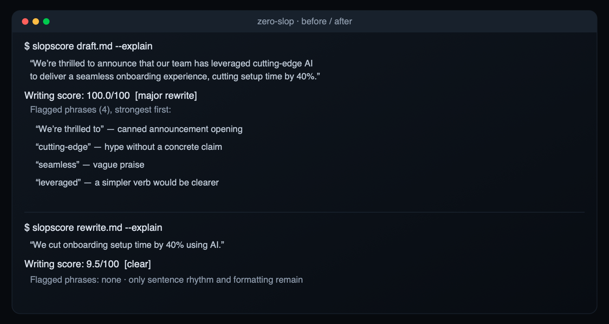
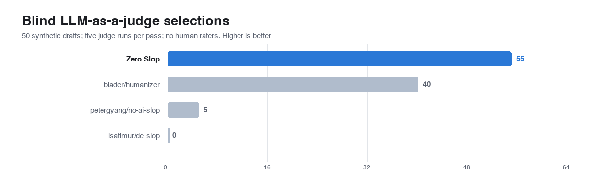
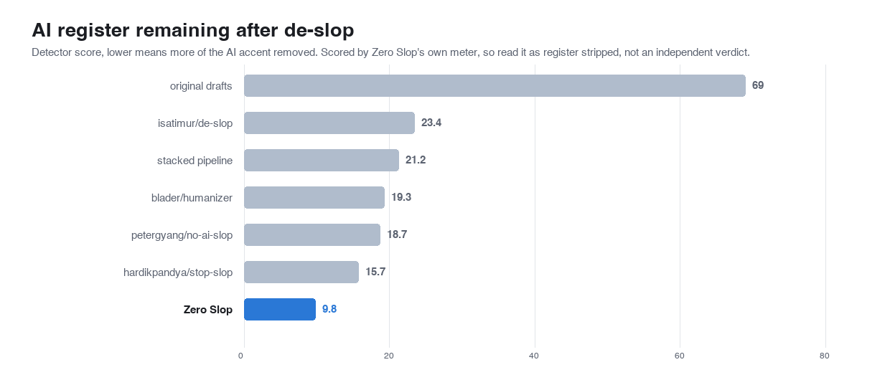

# Zero Slop

<p align="center">
  
  
  
  
  
</p>

You used AI to help with your writing, and now it reads like a machine wrote every
word. You can hear it, and so can everyone who reads it. There is even a word for that
machine sound: slop. On LinkedIn, it gets you accused of not thinking for yourself.

Zero Slop finds that slop in your draft and takes it out, without changing what you
actually said. It gives the writing a score from 0 to 100, points at the exact words
dragging it down, and rewrites them. Then it double-checks that it kept every fact
you had and invented nothing.



That is a real before and after. The first sentence scores 100, which is as sloppy
as it gets. Six phrases are doing the damage, and the tool names each one. Take them
out, and one thing is left standing: setup time dropped 40%. That is what slop usually
is, once you look: a single real fact buried under decoration.

Lower is better. Good human writing lands between 9 and 21, and the raw AI drafts we
tested started around 70. Read the list of flagged phrases first; the number is just
the summary.

## Who it is for

Anyone who writes under their own name and would rather not sound like a robot. A
founder shipping a launch post. A marketer with five posts due this week. A researcher
whose paper needs to stay formal, not get "humanized" into mush. An engineering team
that wants slop to fail a check the way a bug does. If AI helps you write and you
want the result to still sound like you, this is for you.

## Why it matters now

For a while, sounding like AI just cost you a little credibility with the people who
noticed. That changed fast. In two weeks across late July and August 2026, four
platforms started acting on it. LinkedIn added a button that lets any reader flag a
post as AI slop, and flagged posts stop reaching people outside your own network.
Snapchat pulled fully AI-made videos out of its recommendations. YouTube stopped
paying out on generic, mass-produced clips, and Substack shipped a detector its readers
can run on any post.

So the cost moved. It used to be about looking lazy; now it is about who sees your
work at all. One study the platforms keep citing estimates that as much as 40% of
social-media writing is already machine-made. When that much of a feed is slop, the systems ranking
it learn to bury anything that smells the same, and the writing that reads as human is
what gets through.

## Try it

```bash
npx skills add manavmishra/ZeroSlop --global   # then say "de-slop this" in any agent
```

The command above installs it into every agent you have. To narrow that, add `--agent`:
name one (`claude-code`, `codex`, `cursor`, `opencode`, `warp`, `zed`) to install just
there, or drop `--global` to keep it to a single project.

<details>
<summary>Claude Code plugin · ChatGPT · Codex · claude.ai · manual clone</summary>

Claude Code and Cowork, as a plugin:

```
/plugin marketplace add manavmishra/ZeroSlop
/plugin install zero-slop@zero-slop
```

ChatGPT and ChatGPT at Work: paste the single-file version into a Project's
instructions, or upload it as Custom GPT knowledge.

```bash
curl -sLO https://raw.githubusercontent.com/manavmishra/ZeroSlop/main/dist/zero-slop-single-file.md
```

Codex: run this in your own project, not in a copy of this repo, because it writes
`AGENTS.md`.

```bash
curl -sL https://raw.githubusercontent.com/manavmishra/ZeroSlop/main/dist/zero-slop-single-file.md -o AGENTS.md
```

claude.ai and Desktop need a zip that holds just this one skill — not GitHub's green
"Download ZIP" button, which packages the whole repository and gets rejected. Build the
right zip with one command:

```bash
git clone https://github.com/manavmishra/ZeroSlop.git
python3 ZeroSlop/scripts/build_skill_zip.py     # writes ZeroSlop/dist/zero-slop.zip
```

Then upload `dist/zero-slop.zip` under Settings, Capabilities, Skills. The same file is
attached to the [latest release](https://github.com/manavmishra/ZeroSlop/releases/latest)
if you would rather just download it.

By hand, in any tool:

```bash
git clone https://github.com/manavmishra/ZeroSlop.git ~/.claude/skills/zero-slop
```

The folder has to be named `zero-slop`. On Windows, clone into
`$env:USERPROFILE\.claude\skills\zero-slop`.

</details>

You can also run the scorer straight from the command line:

```bash
python3 scripts/slopscore.py --explain draft.md          # score it, and see every flagged phrase
python3 scripts/slopscore.py --gate 25 draft.md          # fail a build if the draft is too sloppy
python3 scripts/slopscore.py --fidelity draft.md new.md  # check the rewrite kept your facts
python3 scripts/slopscore.py --voice you draft.md        # score against your own writing style
```

No install, no account, no server. A single standard-library Python file does the
scoring, and your writing never leaves your machine. If Python isn't there, the skill
still runs from its written rules — you only lose the number.

## How it decides

Slop is not one thing, so the scorer weighs four signals, and only the first looks at
your actual words. That is deliberate. Most of what it measures is the shape of the
writing rather than the vocabulary, which is why running a draft through a thesaurus
does not move the score.

| what it looks at | what gives you away |
|---|---|
| word choice | 74 known tell-phrases, a 55-word watchlist, and 13 words that only count in a salesy sentence |
| rhythm | sentences that are all the same length, paragraphs that march in step |
| readability | comma pile-ups, long-word traffic jams, sentences that run past 38 words |
| formatting | too many em-dashes, emoji, hashtags, bold everywhere |

The scorer is built to accuse slowly. A single em-dash is not slop, and plenty of fine
writing leans on it, so a habit like that carries weight only when the word choice
agrees. Clusters convict; lone signals do not.

The last row of the table does more work than it seems to. Words like *leverage* or
*robust* are ordinary in a runbook and turn into tells only when a marketing word shares
the sentence. "Elevated write volume" in an engineering note is fine; "elevate your brand
with our seamless platform" is not.

There is a fifth signal the four cannot see: whether a *model* finds the writing
predictable, which is the thing detectors lean on hardest — machine text sits where a
model would have put the words. Zero Slop ships no model of its own, so it borrows the
one already running it, the same assistant you are working in, and plays a quick
fill-in-the-blank: mask a spread of words, predict each from its context, and count how
often the guess lands on the word you actually chose. Machine writing is easy to guess;
human word choice surprises it. Because it uses the host model, it needs nothing
installed and reads the same whether that model is Claude or GPT.

Scoring is only half the job. The rewrite runs in two passes; in testing, splitting the
work beat doing it all at once. The first strips the tells and changes nothing else. The
second rebuilds what remains into the voice of someone who knows the subject, with the
clutter gone so nothing can hide a thin point.

It does not settle for one attempt, either. It writes a few rewrites with different
strategies — strip hard, keep the warmth, reorder the argument — and keeps the cleanest
one that loses no fact. A candidate that invents a detail loses to any that does not, no
matter how well it reads, which is the whole point of choosing by the meter instead of
by the taste that wrote them.

## It will not touch your facts

This is where most humanizers fail. To sound more human they will invent a detail you
never wrote, or quietly drop a number to smooth a sentence. Zero Slop treats that as the
one thing it must never do.

Before it calls a rewrite finished, it inventories every figure, name, quote, and link
in your original and confirms that each one survived and that nothing new appeared. The
second half is what protects you: a dropped number you would catch, but an invented one
reads perfectly and sails right past. The check exists because an early version of the
tool did exactly that, handing a writer a feeling they never expressed.

## It gets sharper the more you use it

Most tools are frozen the day they ship. This one learns from you.

The most reliable signal a slop-catcher can get is what you cut after it hands the
draft back. Delete a phrase before publishing and that phrase was a tell it missed. It
watches for those, with one guard: a phrase becomes a rule only after three separate
documents have cut it, so no single person's quirk hardens into law for everyone. The
loop runs both ways. A rule you keep overriding loses weight, and one that stops
catching anything ages out.

```bash
python3 scripts/learn.py --reflect --produced out.md --shipped final.md
python3 scripts/learn.py --promote --apply     # turn agreed-on phrases into rules
python3 scripts/learn.py --voice you --from ~/my-writing/   # teach it your style
python3 scripts/learn.py --stats               # see what it has learned
```

It keeps itself current, too. Each session it checks for a newer release and shows you
the one-line update if one exists — a version query and nothing else, so your writing
still never leaves your machine. And the instructions the rewrite follows are tunable in
the same spirit: the repo ships a reward that scores a rewrite on how much slop it
removed and whether it kept every fact, so Microsoft's [SkillOpt](https://github.com/microsoft/SkillOpt)
can optimize `SKILL.md` against it and keep only edits that improve a held-out score.
One loop sharpens what the meter catches; the other sharpens how the fix is written.

## Does it actually work

We ran it head to head against the four tools it builds on. Fifty AI-heavy drafts across six kinds
of writing, each rewritten by every tool, then scored by judges who could not see which
tool produced which version. Treat it as a careful study rather than a verdict: we
reproduced the competitors' outputs from their published prompts instead of running
their live products, and only our rewrites were tuned against a scorecard, so the field
is not perfectly level.

Across 100 blind picks, judges preferred the Zero Slop version more often than any
other.



The result is narrower than the bar looks. It clearly beat two of the four, and it tied
the strongest of them, blader's humanizer. We judged twice with fresh judges, and the two
rounds barely agreed on a winner — worth holding in mind before leaning on any single
figure.

A steadier measure is how much of the AI register each tool removes. This is scored by
Zero Slop's own detector, so read it as register stripped, not an independent grade.



The last test is the one a writer should care about most: can the tool tell obvious
slop from obvious human writing? Across LinkedIn, blogs, Reddit, newsletters, and short
social posts it separated the two every time, with no overlap. We wrote both piles,
though, so it shows the tool agreeing with an obvious call, not that it will judge every
draft in the wild. It is also fast: around 1,100 documents a second, quick enough to sit
inside a build unnoticed.


## Built on good work

Zero Slop did not invent any of this. It stands on four open-source projects that
worked out the craft first: [petergyang/no-ai-slop](https://github.com/petergyang/no-ai-slop),
[blader/humanizer](https://github.com/blader/humanizer),
[isatimur/de-slop](https://github.com/isatimur/de-slop), and
[hardikpandya/stop-slop](https://github.com/hardikpandya/stop-slop). They proved the
sound can be removed, and their lists of tells seeded ours. What we added is the score,
the fact-check, and the learning loop — the parts that let you measure a rewrite and
trust it.

Worth heading off one confusion: detectors like Pangram and GPTZero are a different tool
for a different job, telling a teacher or an editor whether a machine wrote something.
They do that well. We are not trying to beat them, and we deliberately do not tune our
rewrites to fool them.

## What is next

- **A big, labeled test set.** It is what every accuracy claim here is waiting on.
  RAID, HC3, M4, and AuTextification are free and cover email, social, and blogs.
- **New signals that ignore vocabulary entirely.** The research
  ([NEULIF](https://arxiv.org/abs/2511.21744)) points at how often certain small words
  pair up, and how sentence lengths vary. Both are impossible to dodge with a thesaurus,
  and both need the test set above to tune.
- **Running the competitors live**, so the comparison is a true head-to-head.

## Under the hood

![How the engine works: a draft runs through four surface channels (only the pattern meter reads your wording) that fuse into a 0-100 score, plus a model channel that has the host model guess masked words and is reported beside it; the text is diagnosed, rewritten in two passes as several candidates and reranked to the best faithful one, then cleared only when all three verify checks pass: the numeric gate, a readalong that reads it aloud for stumbles, and a fidelity check. A reflect loop turns the edits you make into sharper patterns, and a tune loop lets SkillOpt improve the instructions themselves.](assets/engine.svg)

```
SKILL.md                    the instructions the AI agent follows
scripts/slopscore.py        the scorer, plain Python, no libraries
scripts/predictability.py   the model channel — cloze probe, answered by the host model
scripts/rerank.py           best of N — pick the cleanest faithful rewrite
scripts/learn.py            the learning loop and your style profile
scripts/calibrate.py        retune from a corpus; retire stale tells
scripts/version_check.py    the once-a-session update check
data/patterns.json          the 74 tells, the watchlist, the context words
data/corpus/must-not-flag/  human writing the tool must never flag
references/readalong.md     the read-aloud pass the verify gate runs
bench/skillopt/             the reward and harness for tuning SKILL.md
tests/test_all.py           72 tests
```

Run `python3 tests/test_all.py` and `python3 scripts/calibrate.py --selftest`. The
tests cover the scorer, the learning safeguards, the retirement of old tells, and speed.
A set of tripwires exists because each of these slipped once: the numbers here have to
match the data, the charts have to match the benchmark, the packaged copies have to be
current, and none of your writing is ever allowed into a tracked file.

## Thanks

Builds on the four projects above, all MIT;
Wikipedia's [Signs of AI writing](https://en.wikipedia.org/wiki/Wikipedia:Signs_of_AI_writing);
and Kagi's [SlopStop](https://help.kagi.com/kagi/features/slopstop.html), which landed on
two of the same ideas we did: wait for a few tells before convicting, and let people
appeal. The thirteen research papers behind the design are listed in
[references/evidence.md](references/evidence.md). The three that carry the most weight:
the finding that detectors read a model's training style rather than the machine itself
(arXiv:2605.19516), the method for spotting over-used words (Kobak et al.,
arXiv:2406.07016), and the study showing detectors wrongly flag more than half of
non-native English writers (arXiv:2304.02819), which is why a non-native sample sits in
our safety set.

MIT.
