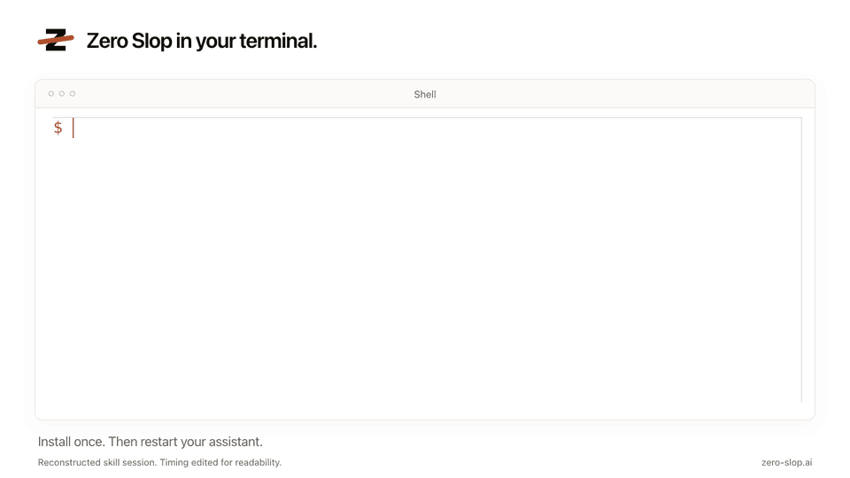
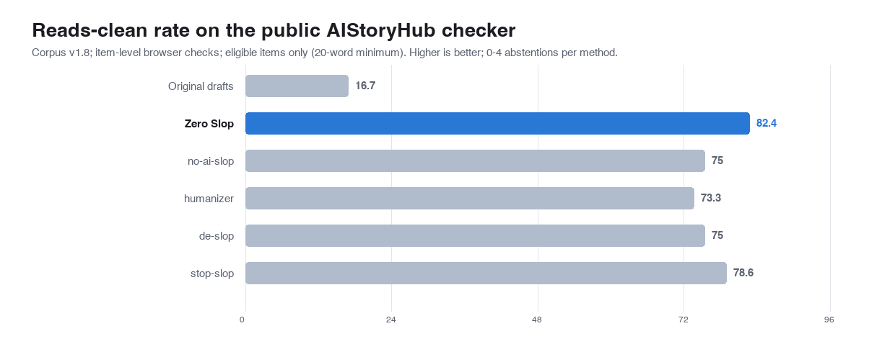
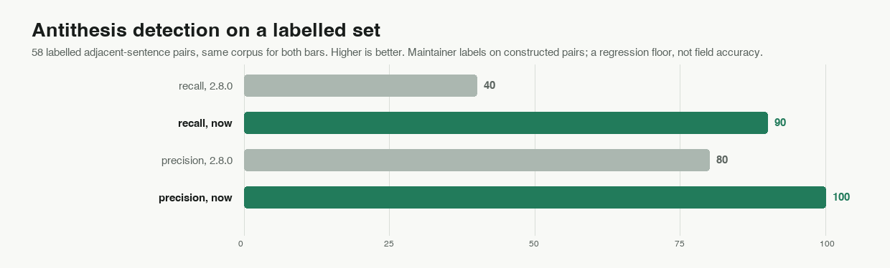

# Zero Slop

<p align="center">
  
  
  
  
  
  <a href="https://hol.org/guard/plugins"></a>
  <a href="https://github.com/hashgraph-online/awesome-ai-plugins#tools--integrations"></a>
  <a href="https://zero-slop.ai/try/"></a>
</p>

Less slop, more pop in your writing.

Zero Slop finds stock phrasing, mechanical rhythm, vague claims, and canned
formatting, then gives your AI assistant or agent harness an editing workflow on guardrails. Its
MIT-licensed local checks run offline; your existing AI assistant or harness does the editing.
Score a draft at [zero-slop.ai/try](https://zero-slop.ai/try/); benchmark at
[zero-slop.ai](https://zero-slop.ai).

```sh
npx zero-slop install
```



### What it does, on a real draft

A launch post, as AI wrote it:

> We're thrilled to announce that our team has leveraged cutting-edge AI to deliver a seamless onboarding experience. It's not just a redesign, it's a fundamental reimagining of how users engage with our platform. In today's fast-paced landscape, the ability to iterate quickly is crucial. By harnessing the power of machine learning, we've been able to reduce setup time by 40%. Here's the thing nobody tells you: onboarding is where most products lose their users. We're excited to continue this journey with you.

`slopscore.py --explain` on that paragraph, unedited:

```text
Writing score: 100.0/100  [major rewrite]
  Flagged phrases : 11 across 83 words
  Sentence variety: too even
  Main issues     : canned LinkedIn phrase, promotional language, manufactured
                    stakes, two-part contrast used as a formula, performed
                    writer's voice, buzzword used as promotion

  Flagged phrases (11), strongest first:
    "In today's fast-paced"  manufactured stakes; start where the reader needs to start
    "We're thrilled to"      canned LinkedIn phrase; say what happened without the stock opening
    "It's not just a redesign, it's"
                             two-part contrast used as a formula; state the claim once, plainly
    "Here's the thing"       performed writer's voice; say the thing plainly
    'cutting-edge'           promotional language; name what it does; cut the adjectives
    'leveraged'              buzzword used as promotion; use the plain word
```

The rewrite, limited to the draft's stated claims:

> We used machine learning to reduce onboarding setup time by 40%.

```text
Writing score: 9.5/100  [clear]
  Flagged phrases : 0 across 10 words
```

## Problem

AI-assisted writing often converges on the same constructions: "It's not X. It's Y."
"Here's the thing nobody tells you." One emdash is fine. Multiple emdashes, definitely slop. The same effect can come from repetition in the wording or the structure. Mechanical rhythm and overworked formatting can do it too.

Zero Slop is an Agent Skill and ships no model. Claude, GPT, or another compatible
model edits; local tools check names, numbers, quotations, links, code, tables, and
paths. Your AI compares meaning because matching words cannot catch every changed
claim. It runs in any harness that reads `SKILL.md`.

## How to install Zero Slop

Paste this into Claude Code, Codex, Cursor, OpenCode, Warp, or Zed:

```text
Install the Zero Slop skill globally from https://github.com/manavmishra/ZeroSlop
```

Or install it with `npx`:

```sh
npx skills add manavmishra/ZeroSlop --global
```

Or from the registry, which also installs the scorer as a command. Zero Slop is
listed in [awesome-ai-plugins](https://github.com/hashgraph-online/awesome-ai-plugins#tools--integrations)
and carries a public profile in the [HOL plugin registry](https://hol.org/guard/plugins),
where its trust score and scanner results are published:

```sh
npx zero-slop install          # add --harness codex|cursor|opencode|zed
npx zero-slop score draft.md   # score without installing anything
```

ChatGPT users can download [`dist/zero-slop-single-file.md`](dist/zero-slop-single-file.md).
Claude.ai users can upload the [latest release ZIP](https://github.com/manavmishra/ZeroSlop/releases/latest/download/zero-slop.zip).
`npx skills update zero-slop --global` updates a skills CLI installation later.

## How to use Zero Slop

```text
/zero-slop (your writing)
```

You get the edited draft, before-and-after scores, and quoted flagged phrases.
`/zero-slop inspect (your writing)` reviews without rewriting. For a folder,
`slopscore.py --batch drafts/ --gate 25` fails above the threshold.

## Show your score

The badge above is this README's own, from `npx zero-slop score README.md`.
Put yours up the same way:

```md
[](https://zero-slop.ai/try/)
```

Colours are the scorer's bands: `0f7d55` under 25, `b8860b` under 60, `b0502c`
above.

## The slop that Zero Slop catches

294 weighted patterns and a 96-term lexicon, including:

1. Binary contrasts: "It's not X. It's Y."
2. Throat-clearing openers: "Here's the thing," "Let me be clear"
3. Faux-insight setups: "What nobody tells you," "The part everyone misses"
4. Colon reveals: "The best part: it learns."
5. Dramatic fragments: "That's it. That's the whole thing."
6. Superficial analysis: "highlighting the team's commitment to innovation"
7. Importance puffery: "marks a pivotal moment," "a testament to"
8. Weasel attribution: "experts agree," "studies show"
9. Synonym cycling: the agent, the assistant, the tool, all one thing.
10. Marketing riders: "robust" and "leverage" score only beside a marketing trigger, so a runbook stays quiet.

A reading pass covers document-wide problems: repeated shapes, crowded statistics,
and paragraphs that shuffle without loss. [`references/eval.md`](references/eval.md)
has all 80 checks.

Human writing scored 9 to 21 in [`data/corpus/must-not-flag/`](data/corpus/must-not-flag/);
unedited AI drafts averaged 77 across [`bench/examples.json`](bench/examples.json).


## How it works


Eight roles form one workflow. Each is a job rather than a service, run as its own pass so nothing grades its own output. The research supports the checks, not the number eight, which is an engineering choice.

| Role | Who does it | What happens |
|---|---|---|
| 1. Scorer | Local tools | Finds the exact phrases behind the writing score, then checks pacing and readability. It also catches overworked formatting. |
| 2. Interpreter | Your AI assistant | Reads the claims, purpose, audience, structure, and voice before changing anything. |
| 3. Rewriter | Your AI assistant | Removes stock language and rebuilds order, rhythm, and tone without inventing detail. |
| 4. Fact gate | Local tools | Rejects any version that changes names, numbers, quotations, links, code, tables, paths, or structure. |
| 5. Copy desk | Fresh AI pass | Corrects grammar, spelling, usage, and consistency in the actual deliverable. |
| 6. Read-aloud editor | Fresh AI pass | Fixes stumbles, repetition, weak transitions, and awkward flow. |
| 7. Verifier | Local tools and your AI assistant | Compares text with source for facts, meaning, qualifiers, voice, format, structure. |
| 8. Fresh-eyes finalizer | Fresh AI pass | Reads the verified text as a first-time reader, applying only safe polish. Any final polish restarts the final checks; the same text must return unchanged before release. |

Studies find
[predictable wording](https://arxiv.org/abs/2301.11305) and
[overused vocabulary](https://arxiv.org/abs/2406.07016) in machine text, and authorship
detectors can [misclassify non-native English](https://arxiv.org/abs/2304.02819). Local
tools use only Python's standard library.

## Private learning from your edits

Learning starts only when you provide the original output and your edited version.
Zero Slop does not monitor files, browsers, or publishing tools.

Private data stays under `$ZERO_SLOP_HOME`.

This human-in-the-loop learning never retrains the model. A profile selected by name
can exempt existing watchlist words; it does not learn cadence, tone, or a complete
style.

## What's inside

[`SKILL.md`](SKILL.md) has the workflow and [`references/eval.md`](references/eval.md) the
80 checks. [`scripts/slopscore.py`](scripts/slopscore.py) is the meter and fact gate,
with [`scripts/register.py`](scripts/register.py) running the reading pass.
[`bench/README.md`](bench/README.md) documents every benchmark with its limits.
[zero-slop.ai](https://zero-slop.ai) has the same reference as browsable pages, plus the [benchmark in full](https://zero-slop.ai/benchmark/).

## Testing and limits

### Against other tools, same model, same drafts

The saved replay ran Zero Slop, [avoid-ai-writing](https://github.com/conorbronsdon/avoid-ai-writing),
[no-ai-slop](https://github.com/petergyang/no-ai-slop) and
[humanizer](https://github.com/blader/humanizer) over 18 drafts with GPT-5.4, high
reasoning, and pinned instructions. Zero Slop's outputs came from v2.5.9; later
releases rescore those frozen outputs rather than pretend to regenerate them.

| Method | Mean writing score ↓ | Passed Zero Slop's local gates | Source check passed | Average length change |
|---|---:|---:|---:|---:|
| Original drafts | 76.3 | 0/18 | — | — |
| Zero Slop | 12.8 | 18/18 | 18/18 | -8.9% |
| avoid-ai-writing | 23.3 | 15/18 | 18/18 | -14.6% |
| no-ai-slop | 28.4 | 12/18 | 17/18 | -13.7% |
| humanizer | 35.4 | 9/18 | 17/18 | -7.2% |


Cross-checks the tools didn't build: the AIStoryHub checker's clean
rates, and a method-hidden quality ranking.




This is a small LLM-reviewed regression study. It measures neither field accuracy nor a
universal ranking. Drafts, hashes, and limits are in [`bench/README.md`](bench/README.md). The separate method-hidden two-way replay used
Zero Slop v2.6.0 and is preserved in
[`bench/incumbent-blind-replay/`](bench/incumbent-blind-replay/).

For the 38-item editorial panel, the current scorer matched the prior 84.2% result.
All frozen scores stayed unchanged, all 18 human controls remained below the gate,
and all 18 obvious search cases remained above it. These fixed-sample checks are not
proof of general accuracy.

### Speed

One busy Apple silicon Mac. Meter: 1,000 documents in 1.9929 seconds (501.8 per
second), 15,201 words in 0.3223 seconds, worst stress case 2.2932 seconds.
Reading pass: 0.7823 seconds for the same 1,000 (1278.3 per
second), 0.1092 for the same large document, linear to 96,000 words. Learning
pass, 8,000 words: 0.1592 seconds. Across 24 interleaved runs against 2.7.7 we measured
0.00% higher median throughput—effectively no difference. Editing
time is excluded.

### Reading-pass accuracy

The reading pass budgets antithesis pairs by frequency, so the count has to be right
before the budget means anything. On 75 labelled pairs in
[`bench/antithesis/`](bench/antithesis/):

| Reading pass | 2.8.0 | now |
|---|---:|---:|
| Recall, all shapes | 40.0% | 91.2% |
| Recall, shapes in reach | 44.4% | 100% |
| Precision | 80.0% | 100% |
| False positives | 3 | 0 |

2.8.3 added the families the 58-pair corpus never tested, where 2.8.2 scores 67.5%
precision.



Bare subject swap and the weak isocolon stay out of reach and count against recall: both
are identical to ordinary prose on every lexical statistic. Maintainer labels on
constructed pairs, so this is a regression floor, not field accuracy.

### Current models

The pinned [RAID+](https://huggingface.co/datasets/markstanl/RAID-Plus) sample yielded
7,627 usable generations:

| Model | Texts scored | Mean writing score ↓ | At or above 25 |
|---|---:|---:|---:|
| DeepSeek V3 | 1,995 | 14.5 | 10.1% |
| Gemini 3.1 Pro | 1,998 | 17.0 | 18.2% |
| Gemma 3 27B | 1,634 | 21.6 | 30.4% |
| Llama 3.3 70B | 2,000 | 25.5 | 41.7% |

RAID+ labels capture which model produced a text, not how well it reads. In
Beemo, raw responses averaged
30.2, expert edits 25.3, human answers 20.0. Neither dataset has quality labels.

## Where Zero Slop came from

Zero Slop builds on work by no-ai-slop, humanizer, de-slop, stop-slop, unslop-text,
and avoid-ai-writing. It adds a writing score, source protection, separate editorial
passes, private learning, portfolio analysis, and release tests.


The chart records which features each project documents. It says nothing about writing quality and is not a claim about which tool writes better. Reproduce by using these tests:

```sh
python3 tests/test_all.py
python3 scripts/calibrate.py --selftest
python3 scripts/register.py --selftest
python3 bench/make_charts.py --check
```

## License

MIT
