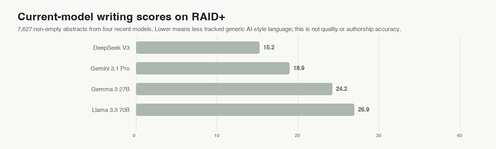

# Zero Slop: AI Writing Editor and Slop Detector

<p align="center">
  
  
  
  
  
</p>

<p align="center">
  <strong><a href="https://zero-slop.ai">zero-slop.ai</a></strong> &middot; examples, benchmarks, and blog
</p>

**Less slop, more pop.**

Zero Slop is an Agent Skill, not an AI model. Claude, GPT, or another compatible model
edits inside your assistant; Zero Slop supplies local checks that protect meaning,
voice, and format.

The 0-to-100 writing score flags generic AI-style language and lists flagged phrases;
it does not identify the author. In the test sets, human samples
scored 9 to 21; unedited AI drafts averaged 77. These are reference points, not
universal cutoffs.


## Install Zero Slop

Paste this into Claude Code, Codex, Cursor, OpenCode, Warp, Zed, or another
Agent Skills-compatible assistant:

```text
Install or update Zero Slop from https://github.com/manavmishra/ZeroSlop for
this agent.

1. Find active installations. Report each path, version, and method. Do not duplicate
   or remove one without asking.
2. For updates, keep the existing install method. In Codex, use $skill-installer for
   `skills/zero-slop`; in Claude Code or Cowork, use the plugin marketplace. Otherwise
   use `npx skills add manavmishra/ZeroSlop --global` to install or
   `npx skills update zero-slop --global` to update.
3. Preserve ZERO_SLOP_HOME (default: ~/.zero-slop) and its private data.
4. Verify the version. When Python is available, run
   `python3 scripts/calibrate.py --selftest`.
5. Report the path, method, version, validation result, and restart requirement.

Do not modify the current project or unrelated configuration. Ask before falling
back to a project-local installation.
```

Direct terminal install:

```bash
npx skills add manavmishra/ZeroSlop --global
```

Claude Code and Cowork use the plugin marketplace. ChatGPT users can
download [`dist/zero-slop-single-file.md`](dist/zero-slop-single-file.md); Claude.ai
users can download the release ZIP.

## How Zero Slop works


Seven roles form one workflow — jobs, not separate models. Your AI assistant handles
the editorial passes; local Python tools run repeatable checks.

| Role | Who does it | What it does |
|---|---|---|
| 1. Scorer | Local tools | Finds exact phrases, mechanical rhythm, dense passages, and distracting formatting; explains the writing score. |
| 2. Interpreter | Your AI assistant | Reads claims, support, audience, structure, and voice before editing. |
| 3. Rewriter | Your AI assistant | Removes stock wording and improves order, rhythm, and tone without inventing detail. |
| 4. Fact gate | Local tools | Rejects versions that add or drop names, numbers, quotations, or links; selects the clearest one left. |
| 5. Copy desk | Fresh AI pass | Corrects grammar, spelling, usage, and consistency. |
| 6. Read-aloud editor | Fresh AI pass | Fixes stumbles, repetition, weak transitions, and awkward flow. |
| 7. Verifier | Local tools and your AI assistant | Compares the final text with the source for facts, meaning, voice, format, and structure. A repair repeats both editorial passes and every check. |

### Why separate the work?

Research supports the checks, not the number seven. Studies find
[predictable wording](https://arxiv.org/abs/2301.11305) and
[excess vocabulary](https://arxiv.org/abs/2406.07016) in machine text, while detectors
can [misclassify non-native English](https://arxiv.org/abs/2304.02819). Writing and
verification stay separate: the rewriter does not certify its own facts, and later
passes catch surviving errors. Local tools use Python's standard library and never send
drafts. The
[research notes](references/evidence.md) cover the rationale and limits.

## Private learning from writer edits

Learning requires the assistant's version and the writer's final version.
Zero Slop never monitors files, browsers, or publishing systems.

A named profile can exempt existing watchlist words in your sample. It applies only
when selected by name and does not learn cadence, tone, or a complete writing style.

A phrase must be cut from three unrelated pieces before becoming a private rule; a
single word needs five. New rules must keep known-human samples clean. Repeated fixes
guide later edits; kept phrases can quiet a rule, and old rules fade. Private state
under `$ZERO_SLOP_HOME` never retrains the AI model.

## What the current release measured

v2.5.8 keeps v2.5.7's context-first review and adds a check for generic lists of
benefits. On the frozen 38-passage consensus panel, accuracy rose from 71.1% to 84.2%.
The new check caught five passages the previous version missed. It did not change any
passage the raters considered clean. Because two LLM editorial raters supplied the
labels, this is a regression result, not human field accuracy.

### Recent model output: RAID+

[RAID+](https://huggingface.co/datasets/markstanl/RAID-Plus) extends the peer-reviewed,
MIT-licensed RAID benchmark. We scored 8,000 pinned rows; 7,627 abstracts
remained after excluding failed or empty generations.

| Model | Texts scored | Mean writing score ↓ | At or above 25 |
|---|---:|---:|---:|
| DeepSeek V3 | 1,995 | 14.5 | 10.1% |
| Gemini 3.1 Pro | 1,998 | 17.0 | 18.2% |
| Gemma 3 27B | 1,634 | 21.6 | 30.4% |
| Llama 3.3 70B | 2,000 | 25.5 | 41.7% |
| **Overall** | **7,627** | **19.6** | **24.8%** |



RAID+ records model origin, not editorial quality, so this is a score distribution,
not an accuracy claim. In a fresh pass over 2,187 Beemo records, raw model responses
averaged 30.2, expert edits 25.3, and independent human answers 20.0. Expert editing
lowered the score in 52.2% of pairs; Beemo lacks quality labels.

### Five workflows, one fixed set of drafts

The 18 saved rewrites use Zero Slop 2.4.3 and pinned competitor instructions. They were
not regenerated. Passing requires clean writing and layout without altered facts or
invented feelings.

| Method | Mean writing score ↓ | Passed all checks | Important details kept | Average length change |
|---|---:|---:|---:|---:|
| Original drafts | 76.3 | 0/18 | — | — |
| Zero Slop | 16.4 | 18/18 | 18/18 | -26.4% |
| humanizer | 25.3 | 13/18 | 18/18 | -25.7% |
| stop-slop | 25.7 | 13/18 | 18/18 | -34.4% |
| no-ai-slop | 29.1 | 12/18 | 18/18 | -28.0% |
| de-slop | 52.3 | 6/18 | 18/18 | -18.5% |


All 18 Zero Slop edits passed, but Zero Slop defines the rules and the rewrites predate
this release. No available set combines current writing with independent human review,
so no universal accuracy number exists. See
[`bench/README.md`](bench/README.md).

### The local tools are fast

On one Apple silicon Mac, the local checker processed 1,000 documents in 2.0147 seconds
(496.4 per second). A 15,201-word document took 0.3222 seconds; the slowest stress case
took 2.5180 seconds. An alternating six-pair comparison measured 29.4% higher median
throughput than v2.5.7. The optimization produced the same complete result as v2.5.7
on all 280 tracked documents. An 8,000-word learning pass took 0.1589 seconds. Time
spent by the AI assistant is excluded.

## What Zero Slop adds

Zero Slop builds on [no-ai-slop](https://github.com/petergyang/no-ai-slop),
[humanizer](https://github.com/blader/humanizer),
[de-slop](https://github.com/isatimur/de-slop), and
[stop-slop](https://github.com/hardikpandya/stop-slop), and draws on
[unslop-text](https://github.com/JCarterJohnson/vibecoded-design-tells/tree/main/unslop-ai-text)
research. It adds a local writing score,
fact protection, separate editorial passes, private learning, and release tests.

The chart records documented features. It does not decide which tool writes better.
Details are in [`bench/README.md`](bench/README.md).


## Reproduce the tests and benchmarks

```bash
python3 tests/test_all.py
python3 scripts/calibrate.py --selftest
python3 bench/search-corpus/compare.py --check
python3 bench/raid-plus-corpus/audit.py --check
python3 bench/beemo-corpus/audit.py --check
python3 bench/validate_corpus_registry.py
python3 bench/make_charts.py --check
```

`SKILL.md` defines the skill; `scripts/` contains tools; `bench/` contains tests. See
the [security policy](SECURITY.md) and [research notes](references/evidence.md).

Released under the [MIT License](LICENSE).
