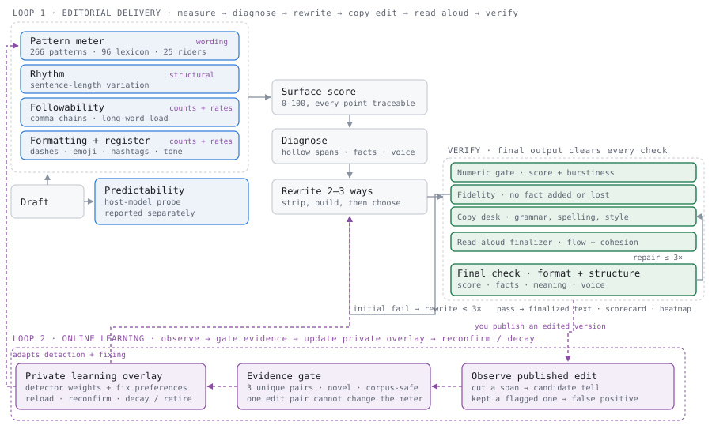
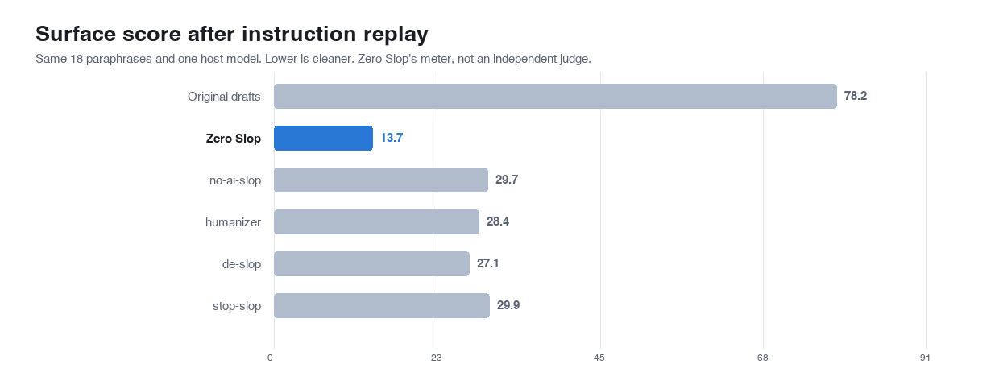
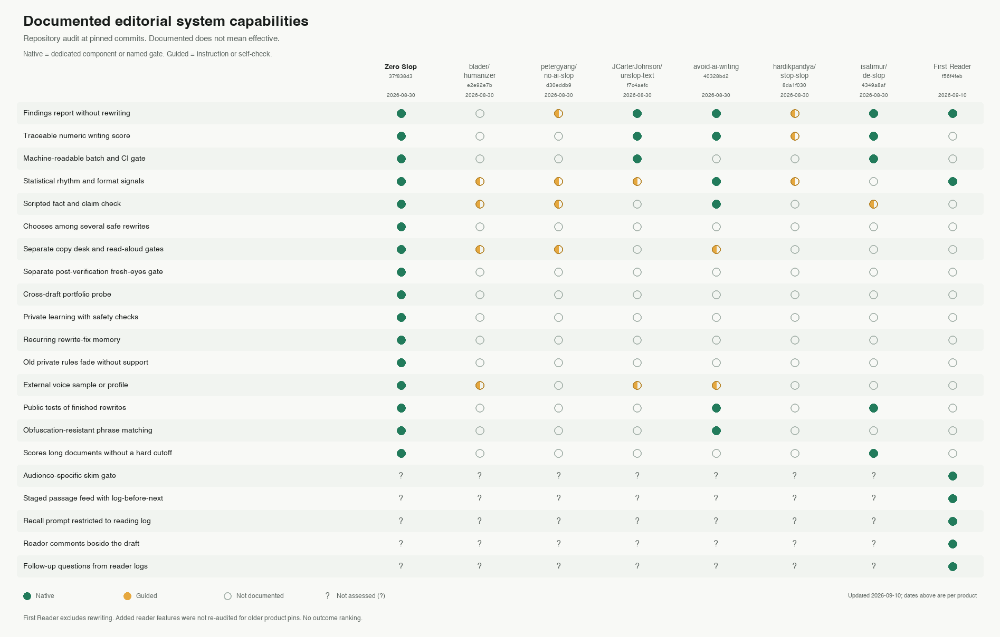

<picture>
  <source media="(prefers-color-scheme: dark)" srcset="assets/logo/zero-slop-logo-reversed.svg">
  
</picture>

# Zero Slop

[](https://mcpvault.io/servers/zeroslop/health?utm_source=external_badge&utm_medium=referral&utm_campaign=mcp_health_report)
[](https://mcpqueen.com/s/io.github.manavmishra/zero-slop)

Find and remove AI slop in your writing. Get rid of workslop without losing your core intent and message.

Zero Slop is a free, open-source agent skill that finds and removes AI slop while checking that the core details of your message survive the edit. If your AI setup does not support agent skills, [try the browser editor](https://zero-slop.ai/try/) or use our [MCP connector](https://mcp.zero-slop.ai/mcp).

<p align="center">
  <a href="https://github.com/manavmishra/ZeroSlop/actions/workflows/validate.yml"></a>
  
  <a href="https://www.npmjs.com/package/zero-slop"></a>
  <a href="https://www.npmjs.com/package/zero-slop"></a>
  <a href="https://github.com/manavmishra/ZeroSlop/stargazers"></a>
  <a href="LICENSE"></a>
  <a href="https://hol.org/registry/plugins/manav-mishra%2Fzero-slop"></a>
  <a href="https://hol.org/guard/plugins?badge=manav-mishra%2Fzero-slop"></a>
</p>

## Why it exists

An AI draft can be grammatically sound and still read like workslop. In a compatible AI assistant, Zero Slop flags slop patterns, then guides the edit. The writing score finds patterns worth reviewing; it cannot tell who wrote the text.

<a href="assets/zero-slop-demo.mp4?v=dark-shell-restored-20260906">
  <picture>
    <source media="(prefers-reduced-motion: reduce)" srcset="assets/zero-slop-demo-poster.png?v=dark-shell-restored-20260906">
    <source type="image/webp" srcset="assets/zero-slop-demo.webp?v=dark-shell-restored-20260906">
    
  </picture>
</a>

## See an edit

Let's see Zero Slop at work. Imagine using AI to write a linkedin launch announcement and getting this:

> We're thrilled to announce that our team has leveraged cutting-edge machine learning to deliver a seamless onboarding experience, reducing setup time by 40%.

The local Python scorer in Zero Slop scores the input Slop score 99.3/100. A high Slop score means the draft is more likely to contain sloppy patterns. 

Zero Slop then strips the patterns and guides the AI agent to produce the deslopped output below:

> We used machine learning to reduce onboarding setup time by 40%.

```text
Writing score: 9.5/100  [clear]
  Flagged phrases : 0 across 10 words
```

## Quick start

The installed skill can make an optional, metadata-only request to GitHub’s public releases API to check for updates. It sends no draft or private learning data. Set `ZS_NO_UPDATE_CHECK=1` to disable it. Hosted MCP requests are separate and are covered by [our privacy policy](https://zero-slop.ai/privacy/).

You can [try the browser editor](https://zero-slop.ai/try/) without installing anything, install the skill in an assistant that supports skills, or use the hosted service through MCP and the API.

If you use Claude Code, Codex, or another assistant that supports skills, here's how to install Zero Slop there:

```sh
npx skills add manavmishra/ZeroSlop --global
```

```text
/zero-slop (your writing)
```

To see the flagged passages without an edit, use `/zero-slop inspect (your writing)`.

The command above works with Claude Code and Codex. In Claude.ai, upload the [skill ZIP](https://github.com/manavmishra/ZeroSlop/releases/latest/download/zero-slop.zip). [Other installation paths](DISTRIBUTION.md) include Gemini CLI and remote MCP connections where your client allows them. You can also [score a file locally](#local-scoring) without a model call.

## What it does

Your AI assistant, whether Claude, GPT, or another compatible model, reads and edits the draft. The skill supplies the workflow and local tools: a 0 to 100 writing score, source-detail checks, and a final comparison with the original.

## What it catches

The scorer uses 294 weighted patterns and a 96-term lexicon. It checks for:

- binary contrast formulas: “It's not X. It's Y.”
- canned openers: “We're thrilled to…” and “Here's the thing…”
- vague attribution: “experts agree” and “studies show”
- significance inflation: “marks a pivotal moment” and “a testament to”
- promotional wording: “robust,” “seamless,” and “leverage” when used as hype
- repeated sentence shapes, crowded statistics, and overworked formatting

## The editing workflow



The Zero Slop agent uses an eight-stage workflow. Each stage is a job with a role, not a separate model; some run in the Python tools and others run in the user's AI app. We treat eight stages as an engineering convention, not eight separate models.

| Stage | Job |
|---|---|
| 1. Scorer | Find exact phrases, pacing problems, readability issues, and overworked formatting. |
| 2. Interpreter | Read the claims, audience, structure, and voice before editing. |
| 3. Rewriter | Remove stock language without inventing detail. |
| 4. Fact gate | Check names, numbers, quotations, links, code, tables, paths, and structure locally. |
| 5. Copy desk | Fix grammar, usage, spelling, and consistency. |
| 6. Read-aloud editor | Catch stumbles, repetition, and awkward transitions. |
| 7. Verifier | Compare the edit with the source for meaning, qualifiers, voice, and format. |
| 8. Fresh-eyes finalizer | Apply only safe final polish, then run one last local check. |

## Evidence and limits

### A saved, same-model editing test

We ran Zero Slop and three other open-source agent skills on our AI Slop test corpus, using GPT-5.4, high reasoning, and pinned instructions. Saved outputs are reproducible.

| Method | Mean writing score ↓ | Passed local gates | Source check passed | Mean length change |
|---|---:|---:|---:|---:|
| Original drafts | 76.3 | 0/18 | — | — |
| **Zero Slop** | **12.8** | **18/18** | **18/18** | -8.9% |
| avoid-ai-writing | 23.3 | 15/18 | 18/18 | -14.6% |
| no-ai-slop | 28.4 | 12/18 | 17/18 | -13.7% |
| humanizer | 35.4 | 9/18 | 17/18 | -7.2% |



The [RAID+ audit](bench/raid-plus-corpus/README.md) asks a different question: how much default writing from different models is flagged as AI slop by Zero Slop? The test corpus contains 7,627 anonymous, user-generated transcripts:

| Model | Texts scored | Mean writing score ↓ | At or above 25 |
|---|---:|---:|---:|
| DeepSeek V3 | 1,995 | 14.5 | 10.1% |
| Gemini 3.1 Pro | 1,998 | 17.0 | 18.2% |
| Gemma 3 27B | 1,634 | 21.6 | 30.4% |
| Llama 3.3 70B | 2,000 | 25.5 | 41.7% |

RAID+ records which model wrote each passage, not whether it reads well.

### Documented features

This is a feature comparison of Zero Slop against other popular slop tools.



The checks draw on research into [predictable machine wording](https://arxiv.org/abs/2301.11305) and [overused vocabulary](https://arxiv.org/abs/2406.07016). Zero Slop cannot identify an author: detectors can [misclassify non-native English](https://arxiv.org/abs/2304.02819).

## Private learning

You can teach Zero Slop a preference by giving it the original output, your edited version, and the reason for the change. Private data stays under `$ZERO_SLOP_HOME` and follows your privacy settings. Zero Slop is an AI slop detector and editor, not a plagiarism tool.

## For developers: other ways to access Zero Slop

### Hosted MCP

The endpoint for compatible clients is:

```text
https://mcp.zero-slop.ai/mcp
```

[Connection options](mcp/README.md).

For Gemini CLI, run `gemini extensions install https://github.com/manavmishra/ZeroSlop --auto-update`. For file-upload assistants, download the [single-file bundle](https://github.com/manavmishra/ZeroSlop/releases/latest/download/zero-slop-single-file.md).

### Local scoring

Score a file without sending it to a model:

```sh
npx zero-slop score draft.md
```

From a cloned checkout, check a folder against the review threshold of 25:

```sh
python3 scripts/slopscore.py --batch drafts/ --gate 25
```

### Command line

The CLI sends a file to the hosted editor without changing the file on disk:

```sh
npx --yes zero-slop@2.12.18 deslop draft.md --genre professional
```

Use `-` for stdin and `--json` for structured output. `--require-approved` prints the result but exits nonzero when review is needed. Requires Node.js 22+; offline `score` also needs Python 3. [CLI options and privacy](docs/cli.md).

### REST API

The REST API accepts the same edit request:

```sh
curl --fail-with-body --max-time 75 https://mcp.zero-slop.ai/v1/deslop \
  -H 'Content-Type: application/json' \
  --data '{"text":"Maya owns the pricing review.","genre":"professional"}'
```

Check `status` before using an edit. Shared free capacity accepts up to 20,000 Unicode code points after trimming. [API reference](docs/rest-api.md) · [OpenAPI contract](https://mcp.zero-slop.ai/openapi.json)

## Find the source

| Path | Purpose |
|---|---|
| [`SKILL.md`](SKILL.md) | The complete detect, rewrite, verify, and learn workflow |
| [`scripts/slopscore.py`](scripts/slopscore.py) | Offline meter and source-detail gate |
| [`scripts/register.py`](scripts/register.py) | Performed-register and reading pass |
| [`references/`](references/) | Genre guidance, tells, safeguards, and evaluation rules |
| [`examples/`](examples/) | Reproducible before-and-after edits |
| [`bench/`](bench/) | Frozen benchmarks, provenance, and limitations |
| [`mcp/`](mcp/) | Optional hosted MCP server documentation |
| [`DISTRIBUTION.md`](DISTRIBUTION.md) | Direct installs, marketplace submissions, and release synchronization |

## Contribute or get help

Found a false positive, a broken check, or a better example? Use the [issue forms](https://github.com/manavmishra/ZeroSlop/issues/new/choose) or start a [Discussion](https://github.com/manavmishra/ZeroSlop/discussions). If you want to change a pattern, read [`CONTRIBUTING.md`](CONTRIBUTING.md) and include tests with your pull request.

For setup help, see [`SUPPORT.md`](SUPPORT.md). Report security issues through [`SECURITY.md`](SECURITY.md).

## Credits

Zero Slop builds on ideas from [First Reader](https://github.com/Shubhamsaboo/awesome-llm-apps/tree/f56f4febaac4eb869c2e98859e78612889913d3e/agent_skills/first-reader), [no-ai-slop](https://github.com/petergyang/no-ai-slop), [humanizer](https://github.com/blader/humanizer), [de-slop](https://github.com/isatimur/de-slop), [stop-slop](https://github.com/hardikpandya/stop-slop), [unslop-text](https://github.com/JCarterJohnson/vibecoded-design-tells/tree/main/unslop-ai-text), and [avoid-ai-writing](https://github.com/conorbronsdon/avoid-ai-writing).

## License

[MIT](LICENSE)
